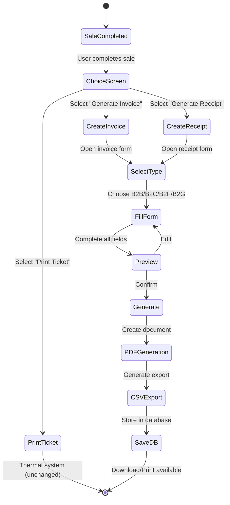

# Design Document - Système de Facturation FNE

## Overview

Le système de facturation FNE ajoute la capacité de générer des **factures et reçus professionnels PDF** à l'application Smart POS existante. Ce système fonctionne en parallèle avec le système de tickets thermiques actuel sans aucune interférence. Les documents générés contiennent l'identité complète de l'entreprise et toutes les informations commerciales et fiscales nécessaires, servant à la fois de factures commerciales officielles et de référence pour la saisie optionnelle sur la plateforme FNE gouvernementale.

### Key Design Principles

1. **Non-Intrusive Integration**: Le système de facturation s'ajoute sans modifier le système de tickets thermiques existant
2. **Professional Documents**: Génération de documents PDF professionnels avec branding complet de l'entreprise
3. **Multi-Tenant Isolation**: Séquences de numérotation et données strictement isolées par tenant
4. **Ivorian Tax Compliance**: Support complet des taux de TVA ivoiriens (0%, 9%, 18%) et taxes additionnelles
5. **Flexible Billing Types**: Support B2B, B2C, B2F, B2G avec validation appropriée
6. **Dual Export**: PDF pour distribution client et CSV pour comptabilité/FNE

### Architecture Integration

Le système s'intègre dans l'architecture existante Smart POS:

```
Frontend (React + TypeScript)
├── Existing: SalesCart.tsx (ajout de boutons Invoice/Receipt)
├── New: InvoiceGenerator.tsx (formulaire création)
├── New: InvoicePreview.tsx (prévisualisation)
├── New: InvoiceHistory.tsx (historique)
└── New: InvoicePDF.tsx (template PDF)

Backend (Node.js + Express + TypeScript)
├── Existing: /api/sales (inchangé)
├── New: /api/invoices/* (nouveaux endpoints)
└── New: Invoice generation service

Database (PostgreSQL/Supabase)
├── Existing: customers (ajout champ NCC)
├── New: invoices
├── New: invoice_items
├── New: invoice_sequences
└── New: invoice_taxes
```

## Architecture

### System Components


#### 1. Invoice Generator Service (Backend)
- Génération de numéros séquentiels avec gestion année/tenant
- Calcul automatique des taxes (TVA 0%, 9%, 18%)
- Calcul des remises (par article et globale)
- Validation des données selon type de facturation
- Génération PDF avec template professionnel
- Export CSV pour comptabilité

#### 2. Invoice API Layer (Backend)
- Endpoints REST pour CRUD factures/reçus
- Validation des requêtes
- Gestion des erreurs
- Authentification et autorisation multi-tenant

#### 3. Invoice UI Components (Frontend)
- Formulaire de création avec validation temps réel
- Sélecteur de type de facturation (B2B/B2C/B2F/B2G)
- Prévisualisation avant génération
- Historique avec recherche et filtres
- Téléchargement PDF et CSV

#### 4. Database Layer
- Tables pour factures, items, séquences, taxes
- Contraintes d'intégrité référentielle
- Indexes pour performance
- Isolation multi-tenant stricte

### Data Flow

```
User Action → Frontend Component → API Request → Backend Service → Database
                                                        ↓
                                                   PDF Generation
                                                        ↓
                                                   CSV Export
                                                        ↓
                                                  File Storage
                                                        ↓
                                                   Response ← Frontend
```

### Workflow Diagram




## Components and Interfaces

### Backend API Endpoints

#### POST /api/invoices
Crée une nouvelle facture ou un nouveau reçu.

**Request Body:**
```typescript
{
  documentType: 'invoice' | 'receipt';
  invoiceType: 'B2B' | 'B2C' | 'B2F' | 'B2G';
  documentSubtype: 'standard' | 'avoir' | 'proforma';
  customerId: number;
  dueDate?: string; // ISO date
  paymentMethod: 'Carte bancaire' | 'Chèque' | 'Espèces' | 'Mobile money' | 'Virement' | 'A terme';
  items: Array<{
    productId: number;
    variantId: number;
    quantity: number;
    unitPriceHT: number;
    discountPercent: number;
    tvaRate: 0 | 9 | 18;
  }>;
  globalDiscountPercent?: number;
  additionalTaxes?: Array<{
    name: string;
    amount: number;
  }>;
  commercialMessage?: string;
}
```

**Response:**
```typescript
{
  success: boolean;
  invoice: {
    id: string;
    invoiceNumber: string;
    pdfUrl: string;
    csvUrl: string;
  };
}
```

**Validation Rules:**
- B2B: Customer must have NCC
- B2C/B2F/B2G: Customer must have name, phone, email
- At least one item required
- TVA rates must be 0, 9, or 18
- All amounts must be positive
- Timbre de quittance auto-added if payment method is "Espèces"


#### GET /api/invoices
Liste les factures et reçus avec filtres et pagination.

**Query Parameters:**
```typescript
{
  page?: number;
  limit?: number;
  startDate?: string; // ISO date
  endDate?: string; // ISO date
  customerName?: string;
  invoiceNumber?: string;
  documentType?: 'invoice' | 'receipt';
  invoiceType?: 'B2B' | 'B2C' | 'B2F' | 'B2G';
  minAmount?: number;
  maxAmount?: number;
}
```

**Response:**
```typescript
{
  success: boolean;
  invoices: Array<{
    id: string;
    invoiceNumber: string;
    documentType: 'invoice' | 'receipt';
    invoiceType: 'B2B' | 'B2C' | 'B2F' | 'B2G';
    documentSubtype: 'standard' | 'avoir' | 'proforma';
    customerName: string;
    date: string;
    totalTTC: number;
    pdfUrl: string;
    csvUrl: string;
  }>;
  pagination: {
    total: number;
    page: number;
    limit: number;
    totalPages: number;
  };
}
```

#### GET /api/invoices/:id
Récupère les détails complets d'une facture ou d'un reçu.

**Response:**
```typescript
{
  success: boolean;
  invoice: {
    id: string;
    invoiceNumber: string;
    documentType: 'invoice' | 'receipt';
    invoiceType: 'B2B' | 'B2C' | 'B2F' | 'B2G';
    documentSubtype: 'standard' | 'avoir' | 'proforma';
    date: string;
    dueDate?: string;
    customer: {
      id: number;
      name: string;
      ncc?: string;
      phone?: string;
      email?: string;
      address?: string;
    };
    items: Array<{
      id: number;
      productName: string;
      variantName: string;
      quantity: number;
      unitPriceHT: number;
      discountPercent: number;
      totalHT: number;
      tvaRate: number;
      tvaAmount: number;
      totalTTC: number;
    }>;
    subtotalHT: number;
    totalDiscounts: number;
    tvaSummary: Array<{
      rate: number;
      base: number;
      amount: number;
    }>;
    totalTVA: number;
    additionalTaxes: Array<{
      name: string;
      amount: number;
    }>;
    totalTTC: number;
    paymentMethod: string;
    commercialMessage?: string;
    pdfUrl: string;
    csvUrl: string;
  };
}
```


#### GET /api/invoices/:id/pdf
Télécharge le PDF de la facture ou du reçu.

**Response:** Binary PDF file with appropriate headers
```
Content-Type: application/pdf
Content-Disposition: attachment; filename="facture-2025-00001.pdf"
```

#### GET /api/invoices/:id/csv
Télécharge l'export CSV de la facture ou du reçu.

**Response:** CSV file with headers
```
Content-Type: text/csv
Content-Disposition: attachment; filename="facture-2025-00001.csv"
```

#### GET /api/invoices/next-number
Obtient le prochain numéro de facture/reçu disponible.

**Query Parameters:**
```typescript
{
  documentSubtype: 'standard' | 'avoir' | 'proforma';
}
```

**Response:**
```typescript
{
  success: boolean;
  nextNumber: string; // e.g., "2025-00042" or "A-2025-00003"
}
```

### Frontend Components

#### InvoiceGenerator Component

**Props:**
```typescript
interface InvoiceGeneratorProps {
  saleData?: Sale; // Optional: pre-fill from completed sale
  documentType: 'invoice' | 'receipt';
  onClose: () => void;
  onSuccess: (invoice: Invoice) => void;
}
```

**State:**
```typescript
interface InvoiceFormState {
  invoiceType: 'B2B' | 'B2C' | 'B2F' | 'B2G';
  documentSubtype: 'standard' | 'avoir' | 'proforma';
  customerId: number | null;
  customerData: {
    name: string;
    ncc?: string;
    phone?: string;
    email?: string;
    address?: string;
  };
  dueDate?: Date;
  paymentMethod: string;
  items: InvoiceItem[];
  globalDiscountPercent: number;
  additionalTaxes: AdditionalTax[];
  commercialMessage: string;
  errors: ValidationErrors;
}
```

**Key Methods:**
- `validateForm()`: Valide tous les champs selon le type de facturation
- `calculateTotals()`: Calcule HT, TVA, TTC en temps réel
- `addItem()`: Ajoute un article à la facture
- `removeItem()`: Retire un article
- `updateItem()`: Met à jour quantité/prix/remise d'un article
- `handleSubmit()`: Soumet la facture pour génération


#### InvoicePreview Component

**Props:**
```typescript
interface InvoicePreviewProps {
  formData: InvoiceFormState;
  companyInfo: CompanyInfo;
  onEdit: () => void;
  onConfirm: () => void;
}
```

Affiche un aperçu fidèle du PDF final avant génération. Permet retour en édition ou confirmation.

#### InvoiceHistory Component

**State:**
```typescript
interface InvoiceHistoryState {
  invoices: Invoice[];
  filters: {
    startDate?: Date;
    endDate?: Date;
    customerName?: string;
    invoiceNumber?: string;
    documentType?: 'invoice' | 'receipt';
    invoiceType?: 'B2B' | 'B2C' | 'B2F' | 'B2G';
    minAmount?: number;
    maxAmount?: number;
  };
  pagination: {
    page: number;
    limit: number;
    total: number;
  };
  selectedInvoice: Invoice | null;
}
```

**Key Methods:**
- `fetchInvoices()`: Charge la liste avec filtres
- `applyFilters()`: Applique les filtres de recherche
- `viewInvoice()`: Affiche les détails d'une facture
- `downloadPDF()`: Télécharge le PDF
- `downloadCSV()`: Télécharge le CSV
- `printInvoice()`: Imprime le PDF

#### InvoicePDF Component

**Props:**
```typescript
interface InvoicePDFProps {
  invoice: InvoiceData;
  companyInfo: CompanyInfo;
}
```

Template PDF professionnel utilisant react-pdf ou jsPDF. Structure:

1. **Header Section**
   - Logo entreprise (gauche)
   - Informations entreprise (droite): nom, adresse, téléphone, email, NCC
   - Type de document en grand: "FACTURE" ou "REÇU"
   - Numéro de document: "N° 2025-00001"

2. **Document Info Section**
   - Date d'émission
   - Date d'échéance (si applicable)
   - Mode de paiement

3. **Customer Info Section**
   - Titre: "Client" ou "Facturé à"
   - Nom client
   - NCC (si B2B)
   - Téléphone, Email, Adresse

4. **Items Table**
   - Colonnes: N°, Description, Qté, Prix Unit. HT, Remise %, Total HT, TVA %, Montant TVA, Total TTC
   - Lignes pour chaque article
   - Styling professionnel avec bordures et alternance de couleurs


5. **Totals Section**
   - Total HT
   - Total Remises
   - TVA 0% (si applicable): Base HT + Montant
   - TVA 9% (si applicable): Base HT + Montant
   - TVA 18% (si applicable): Base HT + Montant
   - Total TVA
   - Autres taxes (détaillées)
   - **Total TTC** (en gras, grande taille)

6. **Footer Section**
   - Message commercial (optionnel)
   - Mentions légales standard
   - Pas de mention FNE, pas de QR code, pas de numéro FNE

#### InvoiceTypeSelector Component

**Props:**
```typescript
interface InvoiceTypeSelectorProps {
  selectedType: 'B2B' | 'B2C' | 'B2F' | 'B2G';
  onChange: (type: 'B2B' | 'B2C' | 'B2F' | 'B2G') => void;
}
```

Affiche 4 boutons/cartes pour sélectionner le type de facturation avec descriptions:
- **B2B**: Facturation entreprise locale (NCC requis)
- **B2C**: Facturation particulier
- **B2F**: Facturation internationale
- **B2G**: Facturation administration publique

### Backend Services

#### InvoiceNumberService

**Methods:**
```typescript
class InvoiceNumberService {
  /**
   * Génère le prochain numéro séquentiel pour un tenant
   * Format: [Prefix-]YYYY-NNNNN
   * Prefix: "" (standard), "A-" (avoir), "P-" (proforma)
   */
  async getNextNumber(
    tenantId: number,
    documentSubtype: 'standard' | 'avoir' | 'proforma'
  ): Promise<string>;

  /**
   * Incrémente le compteur de séquence
   */
  async incrementSequence(
    tenantId: number,
    year: number,
    documentSubtype: 'standard' | 'avoir' | 'proforma'
  ): Promise<void>;

  /**
   * Initialise une nouvelle séquence pour une année
   */
  async initializeSequence(
    tenantId: number,
    year: number,
    documentSubtype: 'standard' | 'avoir' | 'proforma'
  ): Promise<void>;
}
```

**Logic:**
1. Récupère l'année courante
2. Cherche la séquence pour (tenant_id, year, subtype)
3. Si n'existe pas, crée avec last_number = 0
4. Incrémente last_number
5. Formate: `[prefix]YYYY-${String(last_number).padStart(5, '0')}`
6. Retourne le numéro


#### TaxCalculationService

**Methods:**
```typescript
class TaxCalculationService {
  /**
   * Calcule le montant HT à partir du TTC et du taux de TVA
   */
  calculateHT(ttc: number, tvaRate: number): number {
    return ttc / (1 + tvaRate / 100);
  }

  /**
   * Calcule le montant de TVA
   */
  calculateTVA(ht: number, tvaRate: number): number {
    return ht * (tvaRate / 100);
  }

  /**
   * Applique une remise à un montant
   */
  applyDiscount(amount: number, discountPercent: number): number {
    return amount * (1 - discountPercent / 100);
  }

  /**
   * Calcule les totaux d'une facture
   */
  calculateInvoiceTotals(items: InvoiceItem[], globalDiscountPercent: number, additionalTaxes: AdditionalTax[]): InvoiceTotals {
    // 1. Calculer HT par article après remise article
    const itemsWithTotals = items.map(item => {
      const htBeforeDiscount = item.quantity * item.unitPriceHT;
      const htAfterDiscount = this.applyDiscount(htBeforeDiscount, item.discountPercent);
      const tvaAmount = this.calculateTVA(htAfterDiscount, item.tvaRate);
      const ttc = htAfterDiscount + tvaAmount;
      
      return {
        ...item,
        totalHT: htAfterDiscount,
        tvaAmount,
        totalTTC: ttc
      };
    });

    // 2. Calculer subtotal HT
    const subtotalHT = itemsWithTotals.reduce((sum, item) => sum + item.totalHT, 0);

    // 3. Appliquer remise globale
    const discountAmount = subtotalHT * (globalDiscountPercent / 100);
    const totalHTAfterGlobalDiscount = subtotalHT - discountAmount;

    // 4. Recalculer TVA après remise globale (proportionnellement)
    const discountRatio = totalHTAfterGlobalDiscount / subtotalHT;
    const tvaSummary = this.calculateTVASummary(itemsWithTotals, discountRatio);

    // 5. Calculer total TVA
    const totalTVA = tvaSummary.reduce((sum, tva) => sum + tva.amount, 0);

    // 6. Calculer autres taxes
    const totalAdditionalTaxes = additionalTaxes.reduce((sum, tax) => sum + tax.amount, 0);

    // 7. Calculer total TTC
    const totalTTC = totalHTAfterGlobalDiscount + totalTVA + totalAdditionalTaxes;

    return {
      subtotalHT,
      totalDiscounts: discountAmount,
      totalHTAfterDiscount: totalHTAfterGlobalDiscount,
      tvaSummary,
      totalTVA,
      totalAdditionalTaxes,
      totalTTC,
      items: itemsWithTotals
    };
  }

  /**
   * Groupe et calcule la TVA par taux
   */
  private calculateTVASummary(items: InvoiceItemWithTotals[], discountRatio: number): TVASummary[] {
    const tvaByRate = new Map<number, { base: number; amount: number }>();

    items.forEach(item => {
      const adjustedHT = item.totalHT * discountRatio;
      const adjustedTVA = this.calculateTVA(adjustedHT, item.tvaRate);

      if (tvaByRate.has(item.tvaRate)) {
        const current = tvaByRate.get(item.tvaRate)!;
        tvaByRate.set(item.tvaRate, {
          base: current.base + adjustedHT,
          amount: current.amount + adjustedTVA
        });
      } else {
        tvaByRate.set(item.tvaRate, {
          base: adjustedHT,
          amount: adjustedTVA
        });
      }
    });

    return Array.from(tvaByRate.entries())
      .map(([rate, data]) => ({
        rate,
        base: Math.round(data.base * 100) / 100,
        amount: Math.round(data.amount * 100) / 100
      }))
      .sort((a, b) => a.rate - b.rate);
  }

  /**
   * Ajoute automatiquement le timbre de quittance si paiement en espèces
   */
  addTimbreIfCash(paymentMethod: string, additionalTaxes: AdditionalTax[]): AdditionalTax[] {
    if (paymentMethod === 'Espèces') {
      const hasTimbre = additionalTaxes.some(tax => tax.name === 'Timbre de quittance');
      if (!hasTimbre) {
        return [...additionalTaxes, { name: 'Timbre de quittance', amount: 100 }]; // 100 FCFA
      }
    }
    return additionalTaxes;
  }
}
```


#### PDFGenerationService

**Methods:**
```typescript
class PDFGenerationService {
  /**
   * Génère un PDF de facture/reçu
   */
  async generateInvoicePDF(
    invoice: InvoiceData,
    companyInfo: CompanyInfo
  ): Promise<Buffer>;

  /**
   * Sauvegarde le PDF dans le système de fichiers
   */
  async savePDF(
    tenantId: number,
    invoiceNumber: string,
    pdfBuffer: Buffer
  ): Promise<string>; // Returns file path

  /**
   * Récupère un PDF existant
   */
  async getPDF(filePath: string): Promise<Buffer>;
}
```

**PDF Library:** Utiliser `jsPDF` ou `pdfkit` pour Node.js backend

**Template Layout:**
- Format: A4 (210mm x 297mm) ou A5 (148mm x 210mm)
- Marges: 15mm de chaque côté
- Police: Professional sans-serif (Helvetica, Arial)
- Couleurs: Noir pour texte, gris pour bordures, couleur entreprise pour header

#### CSVExportService

**Methods:**
```typescript
class CSVExportService {
  /**
   * Génère un export CSV d'une facture/reçu
   */
  async generateInvoiceCSV(invoice: InvoiceData): Promise<string>;

  /**
   * Sauvegarde le CSV dans le système de fichiers
   */
  async saveCSV(
    tenantId: number,
    invoiceNumber: string,
    csvContent: string
  ): Promise<string>; // Returns file path

  /**
   * Récupère un CSV existant
   */
  async getCSV(filePath: string): Promise<string>;
}
```

**CSV Format:**
```csv
Type,Numéro,Date,Date échéance,Client,NCC Client,Téléphone,Email,Mode paiement
Facture,2025-00001,2025-01-15,2025-02-15,Entreprise ABC,CI-ABJ-2024-A-12345,+225 01 02 03 04,contact@abc.ci,Virement

N°,Description,Quantité,Prix Unit. HT,Remise %,Total HT,TVA %,Montant TVA,Total TTC
1,Produit A,2,10000,0,20000,18,3600,23600
2,Produit B,1,5000,10,4500,9,405,4905

Libellé,Montant
Total HT,24500
Total Remises,500
TVA 9%,405
TVA 18%,3600
Total TVA,4005
Autres taxes,0
Total TTC,28505
```


#### ValidationService

**Methods:**
```typescript
class ValidationService {
  /**
   * Valide les données d'une facture avant génération
   */
  validateInvoice(data: InvoiceFormData): ValidationResult {
    const errors: ValidationError[] = [];

    // Validation type de document
    if (!['B2B', 'B2C', 'B2F', 'B2G'].includes(data.invoiceType)) {
      errors.push({ field: 'invoiceType', message: 'Type de facturation invalide' });
    }

    // Validation client selon type
    if (data.invoiceType === 'B2B') {
      if (!data.customerData.ncc) {
        errors.push({ field: 'customerData.ncc', message: 'NCC requis pour facturation B2B' });
      }
    } else {
      if (!data.customerData.name) {
        errors.push({ field: 'customerData.name', message: 'Nom client requis' });
      }
      if (!data.customerData.phone) {
        errors.push({ field: 'customerData.phone', message: 'Téléphone requis' });
      }
      if (!data.customerData.email) {
        errors.push({ field: 'customerData.email', message: 'Email requis' });
      }
    }

    // Validation articles
    if (!data.items || data.items.length === 0) {
      errors.push({ field: 'items', message: 'Au moins un article requis' });
    }

    data.items.forEach((item, index) => {
      if (item.quantity <= 0) {
        errors.push({ field: `items[${index}].quantity`, message: 'Quantité doit être positive' });
      }
      if (item.unitPriceHT <= 0) {
        errors.push({ field: `items[${index}].unitPriceHT`, message: 'Prix doit être positif' });
      }
      if (![0, 9, 18].includes(item.tvaRate)) {
        errors.push({ field: `items[${index}].tvaRate`, message: 'Taux TVA doit être 0%, 9% ou 18%' });
      }
      if (item.discountPercent < 0 || item.discountPercent > 100) {
        errors.push({ field: `items[${index}].discountPercent`, message: 'Remise doit être entre 0% et 100%' });
      }
    });

    // Validation remise globale
    if (data.globalDiscountPercent < 0 || data.globalDiscountPercent > 100) {
      errors.push({ field: 'globalDiscountPercent', message: 'Remise globale doit être entre 0% et 100%' });
    }

    // Validation mode de paiement
    const validPaymentMethods = ['Carte bancaire', 'Chèque', 'Espèces', 'Mobile money', 'Virement', 'A terme'];
    if (!validPaymentMethods.includes(data.paymentMethod)) {
      errors.push({ field: 'paymentMethod', message: 'Mode de paiement invalide' });
    }

    return {
      isValid: errors.length === 0,
      errors
    };
  }

  /**
   * Valide un NCC ivoirien
   */
  validateNCC(ncc: string): boolean {
    // Format: CI-XXX-YYYY-X-NNNNN
    const nccRegex = /^CI-[A-Z]{3}-\d{4}-[A-Z]-\d{5}$/;
    return nccRegex.test(ncc);
  }

  /**
   * Valide un email
   */
  validateEmail(email: string): boolean {
    const emailRegex = /^[^\s@]+@[^\s@]+\.[^\s@]+$/;
    return emailRegex.test(email);
  }

  /**
   * Valide un numéro de téléphone ivoirien
   */
  validatePhone(phone: string): boolean {
    // Format: +225 XX XX XX XX XX ou 0X XX XX XX XX
    const phoneRegex = /^(\+225|0)[0-9\s]{10,}$/;
    return phoneRegex.test(phone);
  }
}
```


## Data Models

### Database Schema

#### Table: customers (modification)

Ajouter le champ NCC à la table existante:

```sql
ALTER TABLE customers 
ADD COLUMN ncc VARCHAR(50),
ADD COLUMN address TEXT;

CREATE INDEX idx_customers_ncc ON customers(ncc) WHERE ncc IS NOT NULL;
```

#### Table: invoices

```sql
CREATE TABLE invoices (
    id UUID PRIMARY KEY DEFAULT uuid_generate_v4(),
    tenant_id INTEGER NOT NULL REFERENCES tenants(id),
    invoice_number VARCHAR(50) NOT NULL,
    document_type VARCHAR(20) CHECK (document_type IN ('invoice', 'receipt')) NOT NULL,
    invoice_type VARCHAR(10) CHECK (invoice_type IN ('B2B', 'B2C', 'B2F', 'B2G')) NOT NULL,
    document_subtype VARCHAR(20) CHECK (document_subtype IN ('standard', 'avoir', 'proforma')) NOT NULL,
    customer_id INTEGER NOT NULL REFERENCES customers(id),
    date DATE NOT NULL DEFAULT CURRENT_DATE,
    due_date DATE,
    payment_method VARCHAR(50) NOT NULL,
    subtotal_ht DECIMAL(12,2) NOT NULL,
    total_discounts DECIMAL(12,2) DEFAULT 0,
    total_tva DECIMAL(12,2) NOT NULL,
    total_additional_taxes DECIMAL(12,2) DEFAULT 0,
    total_ttc DECIMAL(12,2) NOT NULL,
    global_discount_percent DECIMAL(5,2) DEFAULT 0,
    commercial_message TEXT,
    pdf_path VARCHAR(500),
    csv_path VARCHAR(500),
    created_at TIMESTAMP DEFAULT CURRENT_TIMESTAMP,
    updated_at TIMESTAMP DEFAULT CURRENT_TIMESTAMP,
    created_by INTEGER REFERENCES users(id),
    
    UNIQUE(tenant_id, invoice_number)
);

CREATE INDEX idx_invoices_tenant_id ON invoices(tenant_id);
CREATE INDEX idx_invoices_customer_id ON invoices(customer_id);
CREATE INDEX idx_invoices_date ON invoices(date);
CREATE INDEX idx_invoices_number ON invoices(invoice_number);
CREATE INDEX idx_invoices_type ON invoices(invoice_type);
```

#### Table: invoice_items

```sql
CREATE TABLE invoice_items (
    id SERIAL PRIMARY KEY,
    invoice_id UUID NOT NULL REFERENCES invoices(id) ON DELETE CASCADE,
    line_number INTEGER NOT NULL,
    product_id INTEGER NOT NULL REFERENCES products(id),
    variant_id INTEGER NOT NULL REFERENCES product_variants(id),
    product_name VARCHAR(255) NOT NULL,
    variant_name VARCHAR(255) NOT NULL,
    quantity DECIMAL(10,3) NOT NULL,
    unit_price_ht DECIMAL(12,2) NOT NULL,
    discount_percent DECIMAL(5,2) DEFAULT 0,
    total_ht DECIMAL(12,2) NOT NULL,
    tva_rate DECIMAL(5,2) NOT NULL CHECK (tva_rate IN (0, 9, 18)),
    tva_amount DECIMAL(12,2) NOT NULL,
    total_ttc DECIMAL(12,2) NOT NULL,
    
    UNIQUE(invoice_id, line_number)
);

CREATE INDEX idx_invoice_items_invoice_id ON invoice_items(invoice_id);
CREATE INDEX idx_invoice_items_product_id ON invoice_items(product_id);
```


#### Table: invoice_sequences

```sql
CREATE TABLE invoice_sequences (
    id SERIAL PRIMARY KEY,
    tenant_id INTEGER NOT NULL REFERENCES tenants(id),
    year INTEGER NOT NULL,
    document_subtype VARCHAR(20) CHECK (document_subtype IN ('standard', 'avoir', 'proforma')) NOT NULL,
    last_number INTEGER NOT NULL DEFAULT 0,
    created_at TIMESTAMP DEFAULT CURRENT_TIMESTAMP,
    updated_at TIMESTAMP DEFAULT CURRENT_TIMESTAMP,
    
    UNIQUE(tenant_id, year, document_subtype)
);

CREATE INDEX idx_invoice_sequences_tenant_year ON invoice_sequences(tenant_id, year);
```

#### Table: invoice_taxes

```sql
CREATE TABLE invoice_taxes (
    id SERIAL PRIMARY KEY,
    invoice_id UUID NOT NULL REFERENCES invoices(id) ON DELETE CASCADE,
    tax_name VARCHAR(100) NOT NULL,
    tax_amount DECIMAL(12,2) NOT NULL
);

CREATE INDEX idx_invoice_taxes_invoice_id ON invoice_taxes(invoice_id);
```

### TypeScript Interfaces

#### Invoice Types

```typescript
export interface Invoice {
  id: string;
  tenantId: number;
  invoiceNumber: string;
  documentType: 'invoice' | 'receipt';
  invoiceType: 'B2B' | 'B2C' | 'B2F' | 'B2G';
  documentSubtype: 'standard' | 'avoir' | 'proforma';
  customerId: number;
  date: Date;
  dueDate?: Date;
  paymentMethod: string;
  subtotalHT: number;
  totalDiscounts: number;
  totalTVA: number;
  totalAdditionalTaxes: number;
  totalTTC: number;
  globalDiscountPercent: number;
  commercialMessage?: string;
  pdfPath?: string;
  csvPath?: string;
  createdAt: Date;
  updatedAt: Date;
  createdBy: number;
}

export interface InvoiceItem {
  id: number;
  invoiceId: string;
  lineNumber: number;
  productId: number;
  variantId: number;
  productName: string;
  variantName: string;
  quantity: number;
  unitPriceHT: number;
  discountPercent: number;
  totalHT: number;
  tvaRate: 0 | 9 | 18;
  tvaAmount: number;
  totalTTC: number;
}

export interface InvoiceTax {
  id: number;
  invoiceId: string;
  taxName: string;
  taxAmount: number;
}

export interface InvoiceSequence {
  id: number;
  tenantId: number;
  year: number;
  documentSubtype: 'standard' | 'avoir' | 'proforma';
  lastNumber: number;
}
```


#### Form Data Types

```typescript
export interface InvoiceFormData {
  documentType: 'invoice' | 'receipt';
  invoiceType: 'B2B' | 'B2C' | 'B2F' | 'B2G';
  documentSubtype: 'standard' | 'avoir' | 'proforma';
  customerId?: number;
  customerData: {
    name: string;
    ncc?: string;
    phone?: string;
    email?: string;
    address?: string;
  };
  dueDate?: Date;
  paymentMethod: string;
  items: InvoiceItemInput[];
  globalDiscountPercent: number;
  additionalTaxes: AdditionalTax[];
  commercialMessage?: string;
}

export interface InvoiceItemInput {
  productId: number;
  variantId: number;
  productName: string;
  variantName: string;
  quantity: number;
  unitPriceHT: number;
  discountPercent: number;
  tvaRate: 0 | 9 | 18;
}

export interface AdditionalTax {
  name: string;
  amount: number;
}

export interface InvoiceTotals {
  subtotalHT: number;
  totalDiscounts: number;
  totalHTAfterDiscount: number;
  tvaSummary: TVASummary[];
  totalTVA: number;
  totalAdditionalTaxes: number;
  totalTTC: number;
  items: InvoiceItemWithTotals[];
}

export interface TVASummary {
  rate: number;
  base: number;
  amount: number;
}

export interface InvoiceItemWithTotals extends InvoiceItemInput {
  totalHT: number;
  tvaAmount: number;
  totalTTC: number;
}

export interface CompanyInfo {
  name: string;
  address: string;
  phone: string;
  email: string;
  ncc: string;
  logoUrl?: string;
}

export interface ValidationError {
  field: string;
  message: string;
}

export interface ValidationResult {
  isValid: boolean;
  errors: ValidationError[];
}
```


## Correctness Properties

*Une propriété est une caractéristique ou un comportement qui doit être vrai pour toutes les exécutions valides d'un système - essentiellement, une déclaration formelle sur ce que le système doit faire. Les propriétés servent de pont entre les spécifications lisibles par l'homme et les garanties de correction vérifiables par machine.*

### Property Reflection

Après analyse des critères d'acceptation, plusieurs propriétés redondantes ont été identifiées:

**Redondances identifiées:**
- Propriétés 3.2 et 13.2 (préfixe "A-" pour avoirs) → Consolidées en une seule propriété
- Propriétés 3.3 et 14.2 (préfixe "P-" pour proformas) → Consolidées en une seule propriété
- Propriétés 3.6 et 9.2 (affichage numéro de facture) → Consolidées en une seule propriété
- Propriétés 2.6 et 19.2 (validation champs requis) → Consolidées en une seule propriété
- Propriété 8.3 (timbre de quittance) → Déjà couverte par 7.2

**Propriétés combinées:**
- Validation B2C, B2F, B2G (2.3, 2.4, 2.5) → Une seule propriété pour types non-B2B
- Stockage et récupération de fichiers (20.1, 20.2, 20.3, 20.4) → Propriété de round-trip
- Auto-population customer et product (21.4, 21.5) → Propriété générale d'auto-fill

### Core Properties


#### Property 1: Workflow Isolation
*For any* sale completion, generating a thermal ticket, invoice, or receipt should not interfere with the other document types, and each workflow should function independently.
**Validates: Requirements 1.2, 1.5**

#### Property 2: B2B Validation
*For any* invoice with type B2B, the validation should require a valid NCC for the customer and reject invoices without it.
**Validates: Requirements 2.2, 4.3**

#### Property 3: Non-B2B Validation
*For any* invoice with type B2C, B2F, or B2G, the validation should require customer name, phone, and email fields and reject invoices with missing fields.
**Validates: Requirements 2.3, 2.4, 2.5, 4.4**

#### Property 4: Required Fields Validation
*For any* invoice type, the validation should verify that all required fields for that specific type are completed before allowing generation.
**Validates: Requirements 2.6, 19.2**

#### Property 5: Sequential Number Format
*For any* standard document (invoice or receipt), the generated number should follow the format YYYY-NNNNN where YYYY is the current year and NNNNN is a zero-padded 5-digit sequential number.
**Validates: Requirements 3.1**

#### Property 6: Credit Note Number Format
*For any* credit note (avoir), the generated number should follow the format A-YYYY-NNNNN with the "A-" prefix.
**Validates: Requirements 3.2, 13.2**

#### Property 7: Proforma Number Format
*For any* proforma invoice, the generated number should follow the format P-YYYY-NNNNN with the "P-" prefix.
**Validates: Requirements 3.3, 14.2**

#### Property 8: Year-Based Sequence Isolation
*For any* tenant, documents created in different years should have independent sequential counters, and the counter should reset to 1 when a new year begins.
**Validates: Requirements 3.4, 3.5**

#### Property 9: Document Number Display
*For any* generated invoice or receipt, the document number should be prominently displayed in the rendered output.
**Validates: Requirements 3.6, 9.2**

#### Property 10: Customer Data Persistence
*For any* customer with NCC and contact information, storing the customer should result in the data being retrievable from the database with all fields intact.
**Validates: Requirements 4.5**

#### Property 11: HT Calculation from TTC
*For any* product with a TTC price and TVA rate (0%, 9%, or 18%), the calculated HT amount should equal TTC / (1 + TVA_rate/100), rounded to 2 decimal places.
**Validates: Requirements 5.2**

#### Property 12: Total HT Summation
*For any* invoice with multiple line items, the Total HT should equal the sum of all individual line item HT amounts.
**Validates: Requirements 5.3**

#### Property 13: TVA Grouping and Summation
*For any* invoice with items at different TVA rates, the Total TVA should equal the sum of all TVA amounts grouped by rate (0%, 9%, 18%).
**Validates: Requirements 5.4**

#### Property 14: Total TTC Calculation
*For any* invoice, the Total TTC should equal Total HT + Total TVA + Total Additional Taxes.
**Validates: Requirements 5.5**

#### Property 15: Decimal Precision
*For all* tax and amount calculations, the results should be rounded to exactly 2 decimal places.
**Validates: Requirements 5.6**


#### Property 16: Line Item Discount Application
*For any* line item with a discount percentage, the discounted HT amount should be calculated before TVA calculation, and should equal (quantity × unitPriceHT) × (1 - discountPercent/100).
**Validates: Requirements 6.2**

#### Property 17: Global Discount Application
*For any* invoice with a global discount percentage, the discount should be applied to the subtotal HT before final tax calculations, reducing the base for TVA calculation proportionally.
**Validates: Requirements 6.4**

#### Property 18: Discount Display
*For any* invoice with discounts (line item or global), the total discount amount should be calculated and displayed separately in the totals section.
**Validates: Requirements 6.5**

#### Property 19: Automatic Timbre for Cash
*For any* invoice with payment method "Espèces", the system should automatically add a "Timbre de quittance" tax to the additional taxes list.
**Validates: Requirements 7.2, 8.3**

#### Property 20: No Timbre for Non-Cash
*For any* invoice with payment method other than "Espèces", the system should not include a "Timbre de quittance" in the additional taxes.
**Validates: Requirements 7.3**

#### Property 21: Additional Taxes Inclusion
*For any* invoice with additional taxes, the Total TTC calculation should include all additional tax amounts.
**Validates: Requirements 7.4**

#### Property 22: Payment Method Storage and Display
*For any* invoice with a selected payment method, the method should be stored in the database and displayed on the generated document.
**Validates: Requirements 8.2, 8.4**

#### Property 23: Company Header Inclusion
*For any* generated invoice or receipt, the document should include a header section containing the company logo (if available) and full company details (name, address, phone, email, NCC).
**Validates: Requirements 9.1, 18.1, 18.2, 18.3**

#### Property 24: Date Information Inclusion
*For any* generated invoice or receipt, the document should include the invoice date and, if applicable, the due date.
**Validates: Requirements 9.3**

#### Property 25: Customer Information Display
*For any* generated invoice or receipt, the customer information section should display fields appropriate to the invoice type (NCC for B2B, name/phone/email for others).
**Validates: Requirements 9.4**

#### Property 26: Line Items Table Structure
*For any* generated invoice or receipt, the line items should be displayed in a table format with columns for: N°, Description, Quantity, Unit Price HT, Discount %, Total HT, TVA Rate, TVA Amount, Total TTC.
**Validates: Requirements 9.5**

#### Property 27: Totals Section Completeness
*For any* generated invoice or receipt, the totals section should display: Total HT, Total Discounts, TVA breakdown by rate, Total TVA, Other Taxes, and Total TTC.
**Validates: Requirements 9.6**

#### Property 28: Payment Terms Display
*For any* generated invoice or receipt, the document should include the payment method and payment terms (if applicable).
**Validates: Requirements 9.7**

#### Property 29: Commercial Message Inclusion
*For any* invoice or receipt with a commercial message, the message should be included in the footer section of the document.
**Validates: Requirements 9.8**

#### Property 30: Paper Size Formatting
*For any* generated PDF, the document should be formatted for A4 or A5 paper size with appropriate margins and professional layout.
**Validates: Requirements 9.9**


#### Property 31: No FNE Elements
*For any* generated invoice or receipt, the document should not contain any FNE-specific elements (no FNE logo, no QR code, no FNE number placeholder).
**Validates: Requirements 9.10**

#### Property 32: PDF Generation
*For any* invoice or receipt generation request, the system should create a valid PDF document with all formatting preserved.
**Validates: Requirements 10.1, 10.2**

#### Property 33: PDF Storage with Unique Filename
*For any* generated PDF, the file should be stored in the system with a unique filename based on tenant ID, year, and invoice number.
**Validates: Requirements 10.3**

#### Property 34: CSV Generation Completeness
*For any* invoice or receipt, the generated CSV export should include all invoice information: header data, line items (one row per item), and summary totals.
**Validates: Requirements 11.2**

#### Property 35: CSV Column Structure
*For any* generated CSV export, the file should include the required columns: Invoice Number, Date, Customer Name, Customer NCC, Line Item Description, Quantity, Unit Price HT, Discount %, TVA Rate, TVA Amount, Total HT, Total TTC.
**Validates: Requirements 11.3**

#### Property 36: CSV Line Item Rows
*For any* invoice with N line items, the CSV export should contain N rows in the line items section, one row per item.
**Validates: Requirements 11.4**

#### Property 37: CSV Summary Rows
*For any* CSV export, the file should include summary rows with: Total HT, TVA by rate, Total TVA, Other Taxes, Total TTC.
**Validates: Requirements 11.5**

#### Property 38: CSV Format Validity
*For any* generated CSV file, the format should be valid and parseable by standard spreadsheet applications (proper escaping, delimiters, line endings).
**Validates: Requirements 11.6**

#### Property 39: Invoice History Display Fields
*For any* invoice in the history list, the API should return: invoice number, date, customer name, invoice type, total amount, and status.
**Validates: Requirements 12.2**

#### Property 40: Multi-Criteria Filtering
*For any* invoice search with multiple active filters (date range, customer name, invoice number, type, amount range), the results should include only invoices matching all active filters.
**Validates: Requirements 12.3, 12.4**

#### Property 41: Credit Note Label Display
*For any* credit note (avoir), the generated document should be clearly marked with "FACTURE D'AVOIR" or "AVOIR" label.
**Validates: Requirements 13.4**

#### Property 42: Credit Note Storage Identification
*For any* credit note, the database record should have document_subtype = 'avoir' to distinguish it from standard invoices.
**Validates: Requirements 13.5**

#### Property 43: Proforma Label Display
*For any* proforma invoice, the generated document should be clearly marked with "FACTURE PROFORMA" or "DEVIS" label.
**Validates: Requirements 14.3**

#### Property 44: Proforma Conversion
*For any* proforma invoice converted to a standard invoice, the system should generate a new invoice number with standard format (no "P-" prefix) and independent sequence.
**Validates: Requirements 14.4**

#### Property 45: Proforma Storage Identification
*For any* proforma invoice, the database record should have document_subtype = 'proforma' to distinguish it from standard invoices.
**Validates: Requirements 14.5**


#### Property 46: Referential Integrity
*For any* invoice or receipt stored in the database, all foreign key references (customer_id, product_id, variant_id, tenant_id) should be valid and maintain referential integrity.
**Validates: Requirements 15.6**

#### Property 47: Tenant Isolation in Operations
*For all* invoice and receipt operations (create, read, update, delete), the system should filter by the current tenant ID and never return or modify data from other tenants.
**Validates: Requirements 16.1, 16.3, 16.4**

#### Property 48: Tenant-Specific Sequence Counters
*For any* two tenants, their invoice sequence counters should be completely independent, and generating an invoice for one tenant should not affect the sequence of another tenant.
**Validates: Requirements 16.2**

#### Property 49: Preview Without Persistence
*For any* invoice preview request, the system should display the invoice in final format without creating any database records or generating files.
**Validates: Requirements 17.2**

#### Property 50: Complete Generation on Confirmation
*For any* invoice confirmation after preview, the system should save the invoice to the database, generate the PDF file, and generate the CSV export file.
**Validates: Requirements 17.5**

#### Property 51: Company Information Retrieval
*For any* invoice or receipt generation, the system should retrieve the tenant's company information (name, address, phone, email, NCC) and logo from the database.
**Validates: Requirements 18.1, 18.2**

#### Property 52: Company Information Warning
*For any* invoice generation attempt when company information is incomplete (missing required fields), the system should display a warning before allowing generation.
**Validates: Requirements 18.4**

#### Property 53: Company Information Consistency
*For any* tenant, all generated invoices and receipts should display company information in a consistent format and layout.
**Validates: Requirements 18.5**

#### Property 54: Minimum Line Items Validation
*For any* invoice generation request, the validation should require at least one line item and reject invoices with empty item lists.
**Validates: Requirements 19.1**

#### Property 55: Line Item Validity Validation
*For any* invoice with line items, the validation should verify that all items have positive quantities and positive prices, rejecting invoices with invalid values.
**Validates: Requirements 19.3**

#### Property 56: TVA Rate Validation
*For any* invoice line item, the validation should verify that the TVA rate is exactly 0, 9, or 18, rejecting items with other values.
**Validates: Requirements 19.4**

#### Property 57: Validation Error Reporting
*For any* invoice with validation errors, the system should return specific error messages for each invalid field and prevent invoice generation.
**Validates: Requirements 19.5**

#### Property 58: Validation Success Allows Generation
*For any* invoice that passes all validation rules, the system should allow the generation process to proceed.
**Validates: Requirements 19.6**

#### Property 59: File Storage Structure
*For any* generated PDF or CSV file, the file should be stored in a structured directory path: /invoices/{tenant_id}/{year}/{invoice_number}.{extension}
**Validates: Requirements 20.1, 20.2**

#### Property 60: File Path Persistence
*For any* stored invoice file (PDF or CSV), the file path should be recorded in the database invoice record for later retrieval.
**Validates: Requirements 20.3**


#### Property 61: File Retrieval Round-Trip
*For any* invoice with stored PDF and CSV paths, retrieving the files from those paths should return the complete, valid files that were originally generated.
**Validates: Requirements 20.4**

#### Property 62: Tenant Deletion Archival
*For any* tenant deletion, all associated invoice and receipt files should be archived (moved to archive location) rather than deleted, preserving the data.
**Validates: Requirements 20.6**

#### Property 63: Real-Time Total Updates
*For any* change to line items, discounts, or tax values in the invoice form, the totals should be recalculated immediately and displayed to the user.
**Validates: Requirements 21.2, 21.3**

#### Property 64: Auto-Population from Database
*For any* customer or product selection in the invoice form, the system should automatically populate the relevant fields with data from the database (customer details, product details, default TVA rate).
**Validates: Requirements 21.4, 21.5**

#### Property 65: Legal Information Completeness
*For any* generated invoice or receipt, the document should include all legally required information: company details, customer details, itemized list, tax breakdown, totals, and payment terms.
**Validates: Requirements 22.2**

#### Property 66: Professional Document Structure
*For any* generated invoice or receipt, the document should have a clear structure with distinct sections (header, customer info, items table, totals, footer) and professional formatting.
**Validates: Requirements 22.3**

#### Property 67: FNE Platform Data Completeness
*For any* generated invoice or receipt, the document should contain all information fields necessary for manual entry into the FNE platform (if required by law): company NCC, customer NCC (if B2B), itemized breakdown, TVA by rate, totals.
**Validates: Requirements 22.5**


## Error Handling

### Validation Errors

**Client-Side Validation:**
- Real-time field validation in the invoice form
- Display inline error messages for invalid fields
- Prevent form submission until all errors are resolved
- Clear, specific error messages in French

**Server-Side Validation:**
- Comprehensive validation of all request data
- Return structured error responses with field-specific messages
- HTTP 400 Bad Request for validation failures
- Error response format:
```typescript
{
  success: false,
  error: {
    code: 'VALIDATION_ERROR',
    message: 'Données de facture invalides',
    details: [
      { field: 'customerData.ncc', message: 'NCC requis pour facturation B2B' },
      { field: 'items[0].quantity', message: 'Quantité doit être positive' }
    ]
  }
}
```

### Business Logic Errors

**Sequence Generation Failures:**
- Handle race conditions in sequence number generation with database locks
- Retry logic for transient failures
- Fallback to manual number entry if automatic generation fails repeatedly

**File Generation Errors:**
- Catch PDF generation errors and return meaningful messages
- Retry file storage operations on transient failures
- Log detailed error information for debugging
- Return HTTP 500 with user-friendly message

**Database Errors:**
- Handle foreign key violations (invalid customer_id, product_id)
- Handle unique constraint violations (duplicate invoice numbers)
- Transaction rollback on any error during invoice creation
- Return appropriate HTTP status codes (400 for client errors, 500 for server errors)

### Multi-Tenant Errors

**Tenant Isolation Violations:**
- Verify tenant_id on all operations
- Return HTTP 403 Forbidden if user attempts to access another tenant's data
- Log security violations for audit

**Missing Tenant Data:**
- Handle missing company information gracefully
- Display warnings but allow invoice generation
- Provide clear instructions for completing company profile

### File System Errors

**Storage Failures:**
- Handle disk space issues
- Retry with exponential backoff
- Alert administrators if storage is critically low
- Graceful degradation: save invoice data even if file generation fails

**Retrieval Failures:**
- Handle missing files (deleted or moved)
- Offer regeneration option for missing PDFs
- Log file access errors for investigation

### Network and External Service Errors

**Email Delivery Failures:**
- Queue failed email sends for retry
- Notify user of delivery status
- Provide alternative download options

**Timeout Handling:**
- Set reasonable timeouts for PDF generation (30 seconds)
- Set timeouts for database queries (10 seconds)
- Return partial results or error messages on timeout


## Testing Strategy

### Dual Testing Approach

Le système de facturation nécessite une approche de test duale combinant tests unitaires et tests basés sur les propriétés:

**Tests Unitaires:**
- Exemples spécifiques et cas limites
- Points d'intégration entre composants
- Conditions d'erreur et gestion des exceptions
- Validation de la structure des documents générés

**Tests Basés sur Propriétés (Property-Based Testing):**
- Propriétés universelles valides pour toutes les entrées
- Couverture complète via randomisation
- Validation des invariants mathématiques
- Tests de robustesse avec données aléatoires

### Property-Based Testing Configuration

**Bibliothèque:** fast-check (pour TypeScript/JavaScript)

**Configuration:**
- Minimum 100 itérations par test de propriété
- Chaque test doit référencer sa propriété du document de design
- Format de tag: `// Feature: fne-invoice-system, Property {number}: {property_text}`

**Exemple de test de propriété:**
```typescript
import fc from 'fast-check';

// Feature: fne-invoice-system, Property 11: HT Calculation from TTC
test('HT calculation from TTC should be correct for all TVA rates', () => {
  fc.assert(
    fc.property(
      fc.double({ min: 0.01, max: 1000000 }), // TTC price
      fc.constantFrom(0, 9, 18), // TVA rate
      (ttc, tvaRate) => {
        const ht = calculateHT(ttc, tvaRate);
        const expectedHT = ttc / (1 + tvaRate / 100);
        
        expect(ht).toBeCloseTo(expectedHT, 2);
        expect(ht).toBeLessThanOrEqual(ttc);
      }
    ),
    { numRuns: 100 }
  );
});
```

### Unit Testing Strategy

**Backend Unit Tests:**
- TaxCalculationService: Tests pour chaque méthode de calcul
- InvoiceNumberService: Tests de génération de numéros séquentiels
- ValidationService: Tests de validation pour chaque type de facture
- PDFGenerationService: Tests de génération avec données mockées
- CSVExportService: Tests de format et structure CSV

**Frontend Unit Tests:**
- InvoiceGenerator: Tests de validation de formulaire
- InvoicePreview: Tests de rendu avec données mockées
- InvoiceHistory: Tests de filtrage et recherche
- Composants UI: Tests de rendu et interactions

**Integration Tests:**
- Tests end-to-end du workflow complet: création → prévisualisation → génération → téléchargement
- Tests d'intégration API: appels réels aux endpoints avec base de données de test
- Tests de génération PDF: vérification que les PDFs sont valides et contiennent les bonnes données
- Tests multi-tenant: vérification de l'isolation des données


### Test Coverage Goals

**Code Coverage:**
- Minimum 80% coverage pour le code backend
- Minimum 70% coverage pour le code frontend
- 100% coverage pour les services de calcul critiques (TaxCalculationService)

**Property Coverage:**
- Chaque propriété de correction doit avoir au moins un test de propriété correspondant
- Les propriétés critiques (calculs, validation, isolation multi-tenant) doivent avoir plusieurs tests

**Edge Cases:**
- Factures avec 0 articles (doit échouer)
- Factures avec 1 article
- Factures avec 100+ articles
- Montants très petits (0.01)
- Montants très grands (999999999.99)
- Remises de 0%, 50%, 100%
- Tous les taux de TVA (0%, 9%, 18%)
- Toutes les combinaisons de types de facturation

### Test Data Generators

**Générateurs pour Property-Based Testing:**

```typescript
// Générateur de données client
const customerArbitrary = fc.record({
  id: fc.integer({ min: 1, max: 10000 }),
  name: fc.string({ minLength: 1, maxLength: 100 }),
  ncc: fc.option(fc.string({ minLength: 20, maxLength: 20 })),
  phone: fc.string({ minLength: 10, maxLength: 15 }),
  email: fc.emailAddress(),
  address: fc.option(fc.string({ maxLength: 200 }))
});

// Générateur d'article de facture
const invoiceItemArbitrary = fc.record({
  productId: fc.integer({ min: 1, max: 1000 }),
  variantId: fc.integer({ min: 1, max: 5000 }),
  productName: fc.string({ minLength: 1, maxLength: 100 }),
  variantName: fc.string({ minLength: 1, maxLength: 100 }),
  quantity: fc.double({ min: 0.001, max: 1000 }),
  unitPriceHT: fc.double({ min: 0.01, max: 1000000 }),
  discountPercent: fc.double({ min: 0, max: 100 }),
  tvaRate: fc.constantFrom(0, 9, 18)
});

// Générateur de facture complète
const invoiceArbitrary = fc.record({
  documentType: fc.constantFrom('invoice', 'receipt'),
  invoiceType: fc.constantFrom('B2B', 'B2C', 'B2F', 'B2G'),
  documentSubtype: fc.constantFrom('standard', 'avoir', 'proforma'),
  customer: customerArbitrary,
  items: fc.array(invoiceItemArbitrary, { minLength: 1, maxLength: 50 }),
  globalDiscountPercent: fc.double({ min: 0, max: 100 }),
  paymentMethod: fc.constantFrom('Carte bancaire', 'Chèque', 'Espèces', 'Mobile money', 'Virement', 'A terme'),
  additionalTaxes: fc.array(
    fc.record({
      name: fc.string({ minLength: 1, maxLength: 50 }),
      amount: fc.double({ min: 0, max: 10000 })
    }),
    { maxLength: 5 }
  )
});
```

### Performance Testing

**Load Testing:**
- Test de génération de 100 factures simultanées
- Test de recherche dans historique avec 10000+ factures
- Test de génération PDF avec factures de 100+ articles
- Temps de réponse cible: < 2 secondes pour génération simple, < 5 secondes pour factures complexes

**Stress Testing:**
- Test de génération continue pendant 1 heure
- Test de stockage avec 50000+ factures
- Test de requêtes concurrentes sur séquences (race conditions)

**Database Performance:**
- Index sur tenant_id, invoice_number, date, customer_id
- Requêtes optimisées avec EXPLAIN ANALYZE
- Pagination efficace pour historique (limit/offset ou cursor-based)


## Performance Considerations

### PDF Generation Optimization

**Asynchronous Generation:**
- Générer les PDFs de manière asynchrone pour les factures complexes (50+ articles)
- Utiliser une file d'attente (queue) pour les générations lourdes
- Notifier l'utilisateur quand le PDF est prêt
- Fournir un indicateur de progression pendant la génération

**Caching:**
- Mettre en cache les logos d'entreprise en mémoire
- Mettre en cache les templates PDF compilés
- Invalider le cache lors des mises à jour de branding

**Resource Management:**
- Limiter le nombre de générations PDF simultanées (max 5)
- Libérer la mémoire après chaque génération
- Utiliser des streams pour les gros fichiers

### Database Query Optimization

**Indexing Strategy:**
```sql
-- Index composites pour recherches fréquentes
CREATE INDEX idx_invoices_tenant_date ON invoices(tenant_id, date DESC);
CREATE INDEX idx_invoices_tenant_customer ON invoices(tenant_id, customer_id);
CREATE INDEX idx_invoices_tenant_number ON invoices(tenant_id, invoice_number);

-- Index pour filtres de recherche
CREATE INDEX idx_invoices_type ON invoices(invoice_type);
CREATE INDEX idx_invoices_total ON invoices(total_ttc);

-- Index pour jointures
CREATE INDEX idx_invoice_items_invoice ON invoice_items(invoice_id);
CREATE INDEX idx_invoice_taxes_invoice ON invoice_taxes(invoice_id);
```

**Query Optimization:**
- Utiliser SELECT avec colonnes spécifiques (éviter SELECT *)
- Utiliser JOIN au lieu de requêtes multiples
- Implémenter pagination efficace (LIMIT/OFFSET ou cursor-based)
- Utiliser COUNT(*) avec OVER() pour pagination sans requête séparée

**Connection Pooling:**
- Pool de connexions PostgreSQL (min: 5, max: 20)
- Timeout de connexion: 5 secondes
- Idle timeout: 30 secondes

### Frontend Performance

**Code Splitting:**
- Lazy loading des composants de facturation
- Charger InvoiceGenerator seulement quand nécessaire
- Séparer le code PDF en bundle distinct

**State Management:**
- Utiliser React Context pour état global de facturation
- Mémoïser les calculs de totaux avec useMemo
- Debounce les recalculs lors de la saisie (300ms)

**Data Fetching:**
- Pagination de l'historique (20 factures par page)
- Infinite scroll ou pagination classique
- Précharger la page suivante en arrière-plan
- Cache des résultats de recherche (5 minutes)

### File Storage Optimization

**Storage Structure:**
```
/invoices/
  /{tenant_id}/
    /2025/
      /2025-00001.pdf
      /2025-00001.csv
      /A-2025-00001.pdf
      /A-2025-00001.csv
    /2026/
      /2026-00001.pdf
      ...
```

**File Compression:**
- Compresser les PDFs avec niveau de compression optimal
- Utiliser gzip pour les fichiers CSV
- Archiver les factures anciennes (> 2 ans) dans un stockage froid

**CDN Integration (Optional):**
- Servir les PDFs via CDN pour téléchargements rapides
- Mettre en cache les PDFs fréquemment accédés
- Invalider le cache lors de régénération

### Scalability Considerations

**Horizontal Scaling:**
- Backend stateless pour permettre multiple instances
- Partager le stockage de fichiers (NFS, S3, etc.)
- Load balancer pour distribuer les requêtes

**Database Scaling:**
- Read replicas pour les requêtes de lecture (historique, recherche)
- Write master pour les créations de factures
- Partitionnement par tenant_id si nécessaire (> 1000 tenants)

**Monitoring:**
- Métriques de performance: temps de génération PDF, temps de requête DB
- Alertes sur temps de réponse > 5 secondes
- Monitoring de l'espace disque
- Logs structurés pour debugging


## Security Considerations

### Authentication and Authorization

**User Authentication:**
- Vérifier l'authentification JWT sur tous les endpoints d'API
- Valider le token à chaque requête
- Expiration de session après 24 heures d'inactivité

**Role-Based Access Control:**
- Permissions par rôle pour les opérations de facturation:
  - **Owner/Admin**: Créer, modifier, supprimer, voir toutes les factures
  - **Manager**: Créer, voir les factures de son magasin
  - **Cashier**: Créer des factures uniquement
- Vérifier les permissions avant chaque opération
- Logs d'audit pour toutes les actions sensibles

### Multi-Tenant Security

**Tenant Isolation:**
- Filtrer TOUTES les requêtes par tenant_id
- Utiliser Row-Level Security (RLS) dans PostgreSQL:
```sql
ALTER TABLE invoices ENABLE ROW LEVEL SECURITY;

CREATE POLICY tenant_isolation_policy ON invoices
  USING (tenant_id = current_setting('app.current_tenant_id')::INTEGER);
```

**Tenant Verification:**
- Vérifier que l'utilisateur appartient au tenant avant chaque opération
- Rejeter avec HTTP 403 si tentative d'accès à un autre tenant
- Logger toutes les tentatives d'accès non autorisé

### Input Validation and Sanitization

**Server-Side Validation:**
- Valider TOUS les inputs côté serveur (ne jamais faire confiance au client)
- Utiliser des schémas de validation (Joi, Zod, class-validator)
- Rejeter les requêtes avec données invalides (HTTP 400)

**SQL Injection Prevention:**
- Utiliser des requêtes paramétrées (prepared statements)
- Ne jamais concaténer des inputs utilisateur dans les requêtes SQL
- Utiliser un ORM (TypeORM, Prisma) pour abstraction sécurisée

**XSS Prevention:**
- Échapper tous les inputs utilisateur avant affichage
- Utiliser React (échappe automatiquement)
- Sanitiser les messages commerciaux (pas de HTML/scripts)

**Path Traversal Prevention:**
- Valider les noms de fichiers (pas de ../, /, \)
- Utiliser des chemins absolus pour le stockage
- Vérifier que les fichiers demandés appartiennent au tenant

### Data Protection

**Sensitive Data:**
- NCC client: données sensibles, accès restreint
- Montants de factures: données confidentielles
- Ne jamais logger les données sensibles en clair

**Encryption:**
- HTTPS obligatoire pour toutes les communications
- TLS 1.2+ minimum
- Certificats SSL valides

**Database Security:**
- Connexions chiffrées à la base de données
- Credentials stockés dans variables d'environnement (pas dans le code)
- Principe du moindre privilège pour les comptes DB

### File Security

**File Access Control:**
- Vérifier le tenant_id avant de servir un fichier
- Générer des URLs signées avec expiration (1 heure) pour les téléchargements
- Ne pas exposer les chemins de fichiers réels

**File Upload Security (si applicable):**
- Valider les types de fichiers (logos uniquement)
- Limiter la taille des fichiers (max 5MB pour logos)
- Scanner les fichiers uploadés pour malware
- Stocker les uploads dans un répertoire séparé

### API Security

**Rate Limiting:**
- Limiter les requêtes par utilisateur: 100 requêtes/minute
- Limiter les générations de factures: 20/minute par tenant
- Retourner HTTP 429 si limite dépassée

**CORS Configuration:**
- Configurer CORS pour autoriser uniquement le domaine frontend
- Pas de wildcard (*) en production
- Vérifier l'origine des requêtes

**Security Headers:**
```typescript
// Express middleware
app.use((req, res, next) => {
  res.setHeader('X-Content-Type-Options', 'nosniff');
  res.setHeader('X-Frame-Options', 'DENY');
  res.setHeader('X-XSS-Protection', '1; mode=block');
  res.setHeader('Strict-Transport-Security', 'max-age=31536000; includeSubDomains');
  next();
});
```

### Audit Logging

**Log All Sensitive Operations:**
- Création de facture: user_id, tenant_id, invoice_number, timestamp
- Modification de facture: user_id, invoice_id, changes, timestamp
- Suppression de facture: user_id, invoice_id, timestamp
- Accès aux fichiers: user_id, file_path, timestamp
- Tentatives d'accès non autorisé: user_id, attempted_resource, timestamp

**Log Storage:**
- Logs centralisés et sécurisés
- Rétention minimum 1 an
- Accès restreint aux administrateurs
- Logs immuables (append-only)

### Compliance

**RGPD/Data Privacy:**
- Droit à l'oubli: anonymiser les données client sur demande
- Export des données: fournir toutes les factures d'un client
- Consentement: informer les clients de l'utilisation de leurs données

**Ivorian Tax Compliance:**
- Conserver les factures 10 ans minimum
- Numérotation séquentielle sans trous
- Traçabilité complète de toutes les modifications


## Implementation Notes

### Technology Stack

**Backend:**
- Node.js 18+ avec TypeScript
- Express.js pour l'API REST
- PostgreSQL 14+ (via Supabase)
- jsPDF ou pdfkit pour génération PDF
- csv-writer pour génération CSV

**Frontend:**
- React 19 avec TypeScript
- Vite pour le build
- React Context pour state management
- Axios pour les appels API
- react-pdf ou @react-pdf/renderer pour preview PDF

**Development Tools:**
- ESLint + Prettier pour code quality
- Jest + React Testing Library pour tests
- fast-check pour property-based testing
- Postman/Thunder Client pour tests API

### Migration Strategy

**Phase 1: Database Schema**
1. Créer les nouvelles tables (invoices, invoice_items, invoice_sequences, invoice_taxes)
2. Ajouter les colonnes NCC et address à la table customers
3. Créer les indexes pour performance
4. Tester les migrations sur environnement de dev

**Phase 2: Backend API**
1. Implémenter les services (InvoiceNumberService, TaxCalculationService, ValidationService)
2. Créer les endpoints API
3. Implémenter la génération PDF
4. Implémenter l'export CSV
5. Écrire les tests unitaires et d'intégration

**Phase 3: Frontend Components**
1. Créer InvoiceGenerator component
2. Créer InvoicePreview component
3. Créer InvoiceHistory component
4. Créer InvoicePDF component
5. Intégrer dans SalesCart (boutons Invoice/Receipt)
6. Écrire les tests frontend

**Phase 4: Integration & Testing**
1. Tests end-to-end du workflow complet
2. Tests de performance et charge
3. Tests de sécurité et isolation multi-tenant
4. Corrections de bugs

**Phase 5: Deployment**
1. Déployer sur environnement de staging
2. Tests utilisateurs (UAT)
3. Formation des utilisateurs
4. Déploiement en production
5. Monitoring et support

### Backward Compatibility

**Thermal Ticket System:**
- Aucune modification au système existant
- Les deux systèmes coexistent indépendamment
- Pas de migration des anciens tickets vers factures
- Les utilisateurs peuvent continuer à utiliser les tickets thermiques

**Existing Sales Data:**
- Les ventes existantes restent inchangées
- Pas de rétro-conversion des ventes en factures
- Nouvelles factures créées uniquement pour nouvelles ventes ou sur demande

### Future Enhancements

**Possible Extensions:**
1. **Email automatique des factures** aux clients
2. **Signature électronique** des factures
3. **Intégration FNE automatique** (API officielle si disponible)
4. **Templates de factures personnalisables** par tenant
5. **Multi-devises** pour facturation internationale
6. **Factures récurrentes** pour abonnements
7. **Gestion des acomptes** et paiements partiels
8. **Export comptable** vers logiciels tiers (Sage, QuickBooks)
9. **Statistiques et analytics** sur les factures
10. **Mobile app** pour génération de factures en déplacement

### Known Limitations

1. **Pas d'intégration FNE automatique**: Le système génère des documents de référence, mais la saisie sur la plateforme FNE reste manuelle
2. **Pas de signature électronique**: Les factures ne sont pas signées électroniquement (peut être ajouté plus tard)
3. **Pas de workflow d'approbation**: Les factures sont générées immédiatement sans processus d'approbation
4. **Pas de versioning**: Les modifications de factures ne sont pas versionnées (considérer l'ajout d'un historique de modifications)
5. **Langue unique**: Interface et documents en français uniquement (internationalisation possible plus tard)

### Maintenance Considerations

**Regular Tasks:**
- Archivage des factures anciennes (> 2 ans) vers stockage froid
- Nettoyage des fichiers temporaires
- Vérification de l'intégrité des séquences
- Backup régulier de la base de données
- Monitoring de l'espace disque

**Monitoring Metrics:**
- Nombre de factures générées par jour/mois
- Temps moyen de génération PDF
- Taux d'erreur de génération
- Espace disque utilisé
- Temps de réponse API

**Support:**
- Documentation utilisateur en français
- FAQ pour questions courantes
- Support technique pour problèmes de génération
- Formation des nouveaux utilisateurs

