> **GUIDE** **D’UTILISATION** **DE** **LA**
>
> **PLATEFORME** **FNE**

Mai 2025

Ce document contient 45 pages

**TABLE** **DES** **MATIERES**

**I-**
**Introduction**....................................................................................................................................
4 **1.Objectif** **du**
**guide**.............................................................................................................................
4 **2.Présentation** **du** **dispositif** **de** **facturation**
**normalisée**
**électronique**............................................. 4 **2.1.**
**Pour** **les** **entreprises** **au** **régime**
**réel**........................................................................................
4

> **2.2.** **Pour** **les** **entreprises** **au** **régime**
> **forfaitaire** **et** **les** **entreprises** **du** **secteur**
> **du** **commerce** ...... 5 **3.Configuration**
> **requise**.....................................................................................................................
> 6

**II-** **Inscription** **à** **la** **plateforme**
**FNE**......................................................................................................
6 **III-** **Connexion** **à** **la** **plateforme**
**FNE**................................................................................................
11
**1.Paramétrage**..................................................................................................................................
13 **1.1.** **Création** **de** **nouvel**
**établissement**........................................................................................
14

**1.2.** **Création** **des** **points** **de**
**vente**................................................................................................
15 **2.Gestion** **des** **utilisateurs**
................................................................................................................
16 **IV-** **Présentation** **des** **menus** **de** **la**
**plateforme** **FNE**
.......................................................................
20 **1.Tableau** **de**
**bord**............................................................................................................................
21 **2.Gestion** **des** **stickers**
......................................................................................................................
24 **3.Gestion** **des** **reçus** **et** **factures**
.......................................................................................................
26 **3.1.** **Reçus** **et** **factures** **émis**
..........................................................................................................
26 **3.1.1.** **Processus** **d’édition** **d’une** **facture**
................................................................ 27

> **3.1.2.** **Affichage** **et** **description** **du** **formulaire**
> **de** **facturation**............................. 28 **3.1.3.**
> **Générer** **la**
> **facture**..............................................................................................
> 29
>
> **3.1.3.1.**
>
> **3.1.3.2.**
>
> **3.1.3.3.**
>
> **3.1.3.4.**
>
> **3.1.3.5.**
>
> **3.1.3.6.**

**Informations** **du** **client**
..................................................................................
30 **Ajouter** **un**
**article**...........................................................................................
31
**Remise**..............................................................................................................
32 **Taxes** **sur** **total**
**TTC**.......................................................................................
33 **Résumé** **de** **la**
**facture**....................................................................................
34

**Boutons**
**d’action**............................................................................................
34

> **3.1.4.** **Générer** **une** **facture**
> **d’avoir**............................................................................
> 35 **3.2.** **Reçus** **et** **factures,**
> **réceptionnés**............................................................................................
> 37
>
> **4.Clients** **et** **fournisseurs**
> ..................................................................................................................
> 37
> **5.Paramétrage**..................................................................................................................................
> 38 **6.Gestion** **des** **utilisateurs**
> ................................................................................................................
> 38 **7.Nomenclature**
> ...............................................................................................................................
> 38

**V-** **Spécification** **du**
**sticker**.................................................................................................................
39

> p\. 1
>
> **1-Le** **logo**
> ...........................................................................................................................................
> 39 **2-Le** **numéro** **de** **facture** **selon** **un** **format**
> **spécial** **en** **série** **annuelle**
> **ininterrompue**...................... 40 **3-Le** **QR** **Code**
> **de** **certification**
> ..........................................................................................................
> 40

**VI-** **Composition** **d’une** **FNE**
............................................................................................................
41 **VII-** **Composition** **d’une**
**RNE**............................................................................................................
42 **VIII-** **Contacts**
**utiles**...........................................................................................................................
44

> p\. 2

**ABREVIATIONS**

> • **B2B** : Business to Business • **B2C** : Business to Consumer •
> **B2F** : Business to Foreign
>
> • **B2G** : Business to Governement • **CGI** : Code Général des
> Impôts • **CNI** : Carte Nationale d’Identité
>
> • **DFE** : Déclaration Fiscales d’Existence (DFE) • **DGI** :
> Direction Générale des Impôts (DGI)
>
> • **FNE** : Facture Normalisé Electronique • **HT** : Hors Taxes
>
> • **LPF** : Livre des Procédures Fiscales
>
> • **NCC** : Numéro de Compte Contribuable • **NTD** : Numéro de
> Télédéclarant
>
> • **OTP** : One Time Password • **PU** **:** Prix Unitaire
>
> • **QR** **Code** **:** Quick Response Code
>
> • **RNE** : Reçu Normalisé Electronique (RNE)
>
> • **TERNE** : Terminaux d’Emission de Reçus Normalisés Electroniques •
> **TTC** : Toutes Taxes Comprises
>
> • **TVA** : Taxe sur la Valeur Ajoutée
>
> p\. 3
>
> **I-** **Introduction** **1.** **Objectif** **du** **guide**

Ce guide a pour vocation d’accompagner les utilisateurs dans la prise en
main et l’utilisation efficace de la plateforme de Facturation
Électronique Normalisée (FNE).

Il a pour objectifs principaux de :

> \- Présenter les modalités d’accès et de navigation sur la plateforme
> ;
>
> \- Détailler les étapes d’inscription à la plateforme ainsi que celles
> de création, de transmission, et de certification des factures
> électroniques conformément à la réglementation en vigueur ;
>
> \- Expliquer les différentes fonctionnalités disponibles ;
>
> \- Promouvoir une utilisation conforme, sécurisée et fluide du système
> afin d'assurer la traçabilité, l’authenticité et l’intégrité des
> factures transmises à l’administration fiscale.

Ce guide s’adresse à l’ensemble des entreprises et entités concernées
par l’obligation de facturation électronique et utilisant la plateforme
FNE dans le cadre de leurs opérations fiscales et commerciales tel que
stipulé dans les dispositions de 2005 en ses articles 384, 385 et
suivants du code général des impôts (CGI) et en ces articles 144 et
suivants du livre de procédures fiscales (LPF).

> **2.** **Présentation** **du** **dispositif** **de** **facturation**
> **normalisée** **électronique** **2.1.** **Pour** **les**
> **entreprises** **au** **régime** **réel**

L’entreprise utilisera la plateforme pour éditer, générer et transmettre
la facture en temps réel à l’acheteur. Pour les transactions avec les
particuliers ou à l’international, la transmission pourra se faire via
email ou par remise en main propre par l’entreprise.

> p\. 4

> **2.2.** **Pour** **les** **entreprises** **aurégimeforfaitaire**
> **etlesentreprises** **du** **secteur** **du** **commerce**

Pour les entreprises au régime forfaitaire ou travaillant dans le
secteur du commerce, les transactions seront sécurisées par des reçus
normalisés électroniques délivré via des Terminaux d’Emission de Reçus
Electroniques (TERNE).

>  style="width:3.33722in;height:3.25903in" />***TERNE/Application***
> ***mobile***
>
> p\. 5

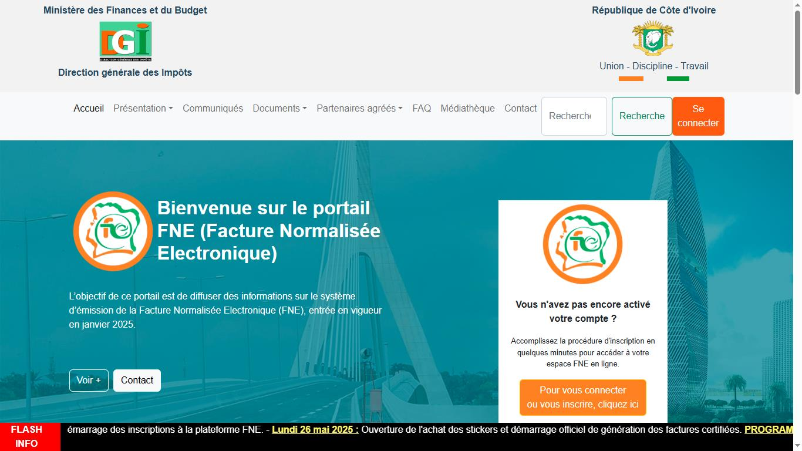

> **3.** **Configuration** **requise**

Il est recommandé de s’assurer que vous utilisez la dernière version du
navigateur installé sur votre ordinateur, afin de garantir un
fonctionnement optimal et sans interruption de la plateforme.

> **II-** **Inscription** **à** **la** **plateforme** **FNE**

**Etape** **1** **:** rendez-vous sur le site
[**<u>https://fne.dgi.gouv.ci/</u>**](https://fne.dgi.gouv.ci/) et
cliquez sur le bouton “**Pour** **vous** **connecter** **ou** **vous**
**inscrire,** **cliquez** **ici**”.

**Etape** **2** **:** cliquez sur « **Inscrivez-vous** » pour entamer la
procédure d’inscription à la plateforme FNE.

> p\. 6

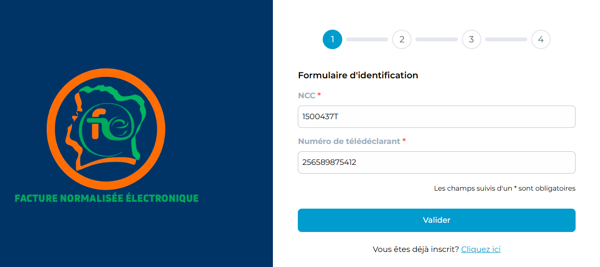

**<u>Etape 3</u>** **:** renseigner le formulaire d'identification en
mentionnant votre Numéro de Compte

Contribuable (**NCC)** et votre Numéro de Télédéclarant **(NTD)**.

> p\. 7

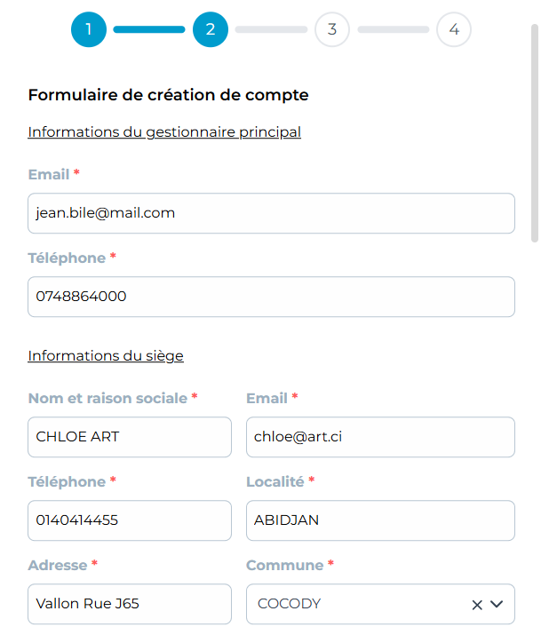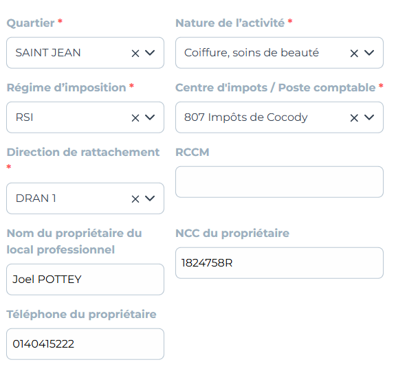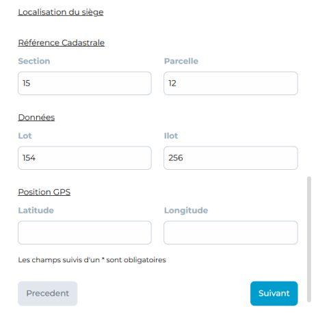

**<u>Etape 4</u>** : renseignez ensuite le formulaire de création de
compte. Cette session est relative

aux informations de l’entreprise. Remplissez tous les champs et passez à
l’étape suivante.

> ***Remarque*** *:* *pour* *les* *informations* *relatives* *à* *la*
> *localisation* *du* *siège,* *vous* *devez* *renseigner* *soit* *:*
>
> \- *La* *section* *et* *la* *parcelle* *;* - *Le* *lot* *et* *l’ilot*
> *;*
>
> \- *La* *longitude* *et* *la* *latitude.*
>
> *Cela* *s’applique* *également* *à* *la* *localisation* *des*
> *établissements* *que* *vous* *aurez* *à* *créer* *par* *la* *suite.*
>
> p\. 8

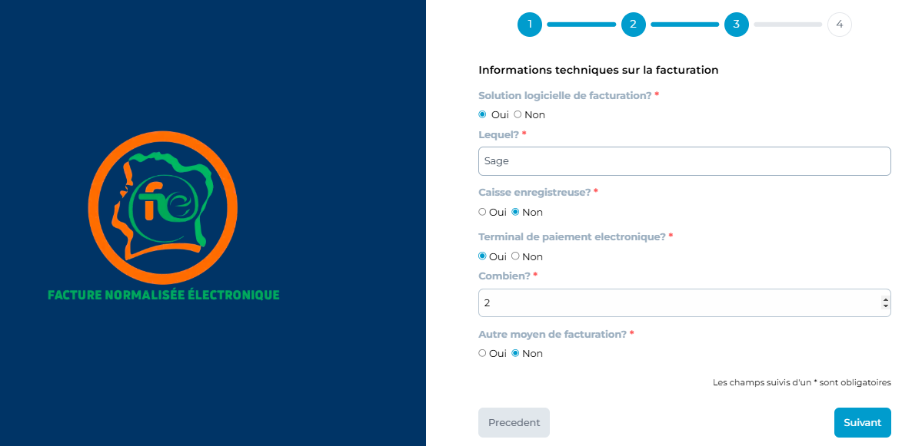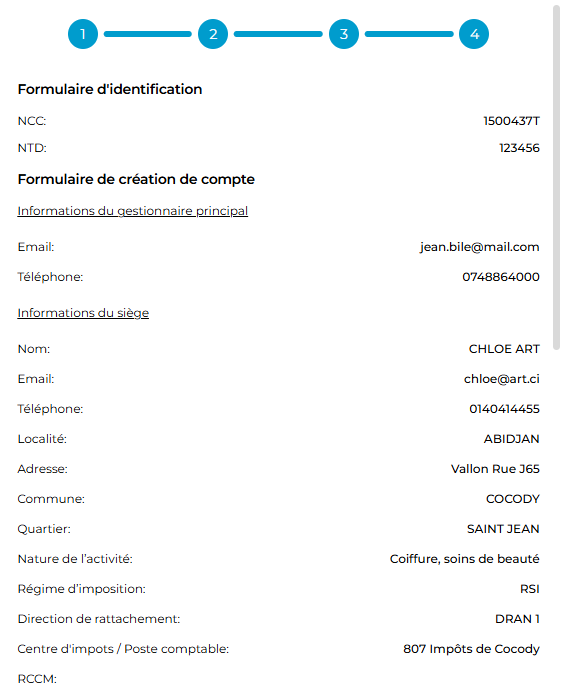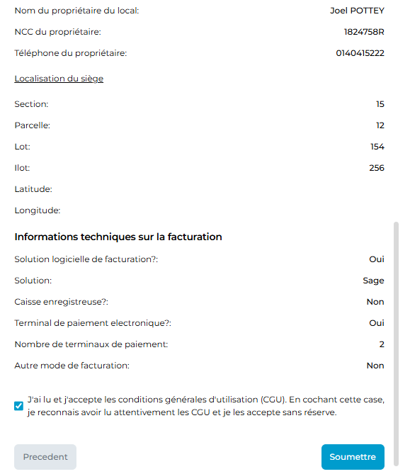

**Etape** **5** : renseignez les informations techniques sur la
facturation

**Etape** **6** : cette page vous permet de vérifier l’exactitude des
informations mentionnées précédemment avant de soumettre votre
inscription. En cas d’erreur, vous avez la possibilité de corriger les
informations en retournant sur la (les) page(s) concernée(s).

Une fois la vérification terminée, cochez les CGU et soumettez votre
inscription en cliquant sur **Soumettre.**

> ***Remarque*** *:* *une* *erreur* *sur* *l’email* *du* *gestionnaire,*
> *vous* *empêchera* *d’avoir* *accès* *à* *votre* *espace.* *Vous*
> *serez* *dans* *l’obligation* *de* *(d’)* *:*
>
> \- *Adresser* *une* *demande* *de* *réinitialisation* *de* *votre*
> *compte* *;* - *Fournir* *la* *DFE* *de* *l’entreprise* *;*
>
> \- *Fournir* *une* *copie* *de* *votre* *CNI.*
>
> p\. 9

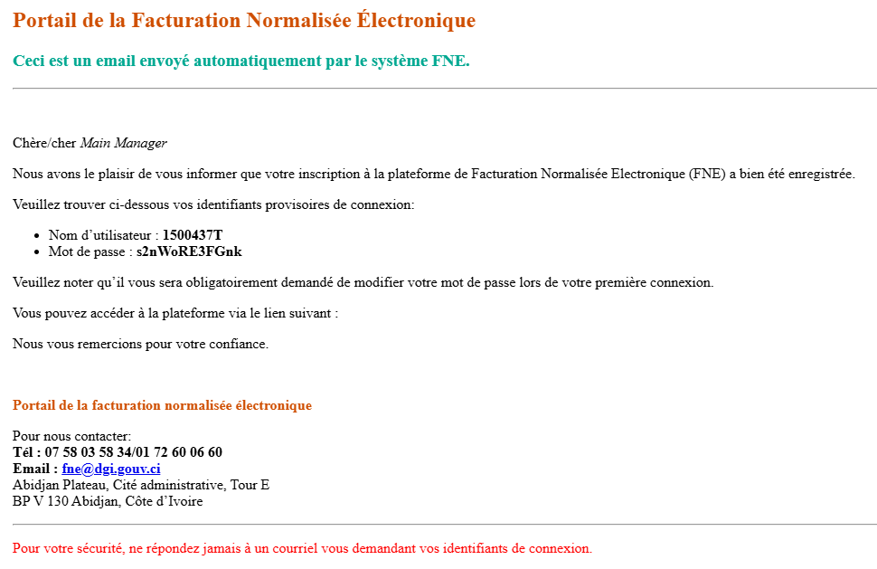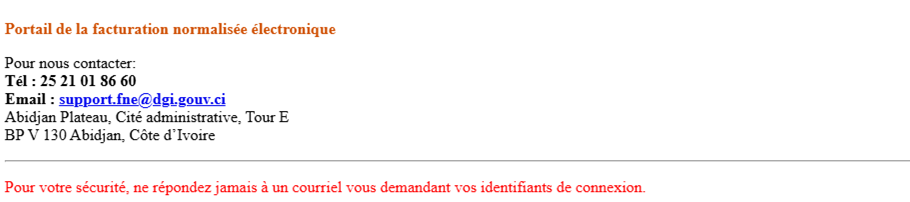

**Etape** **7** **:** après soumission de vos informations, vous
recevrez un mail de confirmation

d’inscription à l’adresse email du gestionnaire.

**Ce** **mail** **comporte** **le** **nom** **d’utilisateur** **et**
**le** **mot** **de** **passe** **à** **utiliser** **pour** **votre**
**première** **connexion** **à** **la** **plateforme.**

> p\. 10

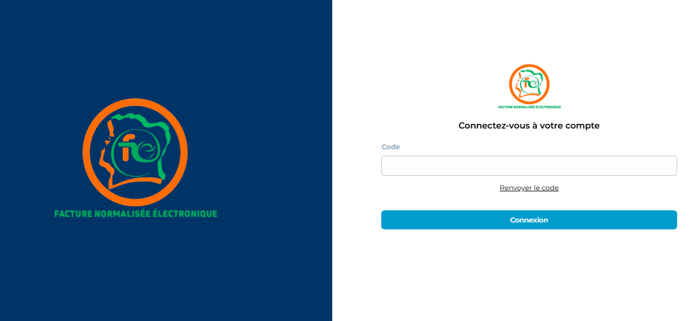

**III-** **Connexion** **à** **la** **plateforme** **FNE**
Unefoisvotreinscriptiondûmentvalidée,vouspourrezaccéderà
laplateformeFNEensuivant les étapes décrites ci-après :

**Etape** **1** : connectez-vous à la plateforme FNE avec les
identifiants reçus par mail.

> ***Remarque*** *:* *pour* *le* *gestionnaire* *principal,* *le*
> ***nom*** ***d’utilisateur*** *est* *le* ***NCC*** *de*
> *l’entreprise.*

**Etape** **2** : Vous recevrez un code OTP dans votre boîte mail.
Veuillez le saisir dans le champ indiqué et validez.

> p\. 11

**Etape** **3** : vous devez **impérativement** **changer** **votre**
**mot** **de** **passe** en vous assurant qu’il

compte **à** **minima** ***douze*** ***(12)*** ***caractères*** composés
notamment : - *Un* *chiffre* *;*

> \- *Une* *lettre* *majuscule* *;* - *Une* *lettre* *minuscule* *;*
>
> \- *Un* *caractère* *spécial* *(\$,* *&,* *@,* *…).*

**Etape** **4** : une fois votre mot de passe modifié, il est nécessaire
de vous reconnecter à la plateforme FNE en reprenant les étapes décrites
aux points 8 et 9. Veillez, dans ce cas, à utiliser **votre**
**nouveau** **mot** **de** **passe**.

> p\. 12

> ***Remarque*** *:* *un* *code* *OTP* *vous* *sera* *transmis* *à*
> *chaque* *tentative* *de* *connexion* *à* *la* *plateforme.*

**Configuration** **de** **votre** **espace** **FNE** **1.**
**Paramétrage**

A la fin du processus d'inscription, vous devrez configurer votre
espace. - Allez dans Paramétrage pour configurer les éléments suivants :

> o Importez votre logo (ce logo apparaitra sur toutes vos factures) ; o
> Seuil d’alerte de vos stickers ;
>
> o Cochez Timbre de quittance si vous voulez faire supporter le coût
> des timbres de quittance aux clients qui règleront leurs factures en
> espèces, le coût du timbre sera affiché sur les factures (***NB*** *:*
> *Si* *vous* *ne* *cochez* *pas* *cette* *case,* *vous* *prenez*
> *l’engagement* *de* *supporter* *les* *frais* *auprès* *de* *la*
> *DGI)* *;*
>
> o Cochez **Bordereau** **d'achat** **de** **produits** **agricoles**
> si vous délivrez des bordereaux d'achat de produits agricoles ;
>
> o Interfaçage avec une solution de facturation ; o Pied de page et un
> message commercial.
>
> p\. 13

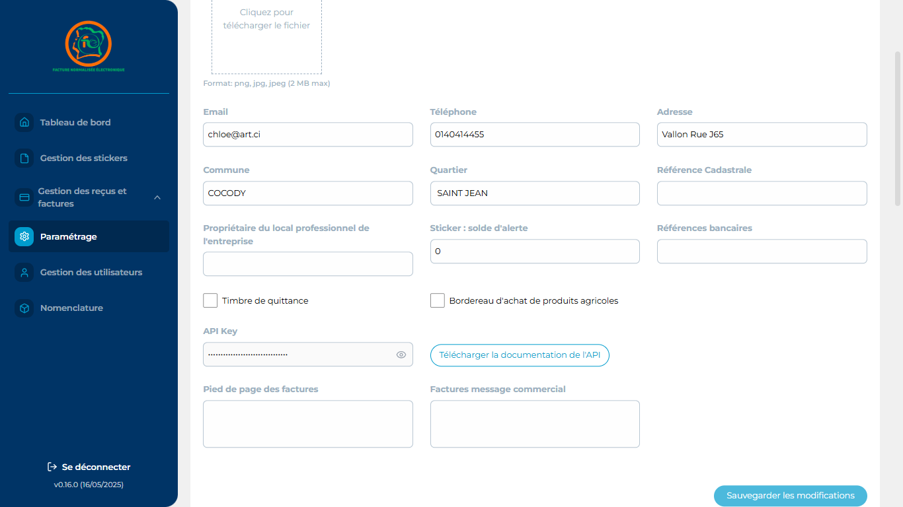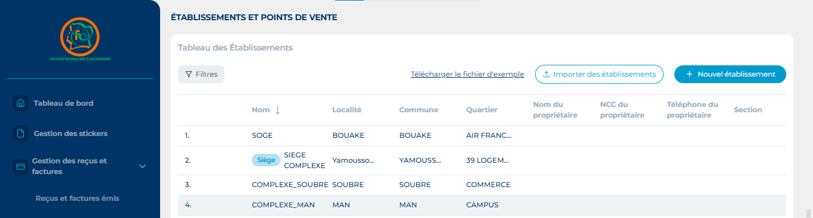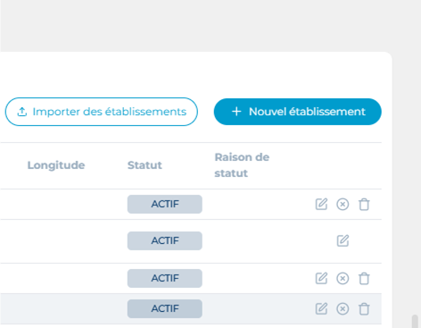

> **1.1.** **Création** **de** **nouvel** **établissement**

Ajoutez vos établissements secondaires en cliquant sur « **+**
**Nouvel** **établissement** **».**

Fonctionnalité des boutons :

>  style="width:3.94333in;height:0.775in" /> style="width:0.31247in;height:0.35485in" /> style="width:0.31247in;height:0.31735in" /> style="width:0.31247in;height:0.35485in" />Apporter des modifications
> sur un formulaire ;
>
> Supprimer un établissement ;
>
> Désactiver l’accès à un établissement.

Remplir le formulaire et cliquer sur **«** **Créer** **».**

> p\. 14

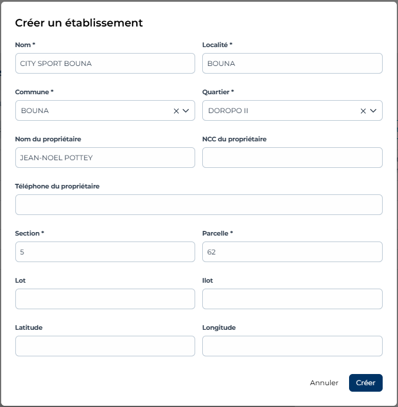

> **1.2.** **Création** **des** **points** **de** **vente**

Le point de vente représente une caisse de votre établissement. Si vous
disposez de ‘’**N** **caisse**’’, il vous faut créer ‘’**N** **point**
**de** **vente**’’. Chaque point de vente est relié à un établissement.

Créez un nouveau point de vente en cliquant sur **«** **+** **Nouveau**
**point** **de** **vente** **».**

>  style="width:6.27833in;height:1.56167in" />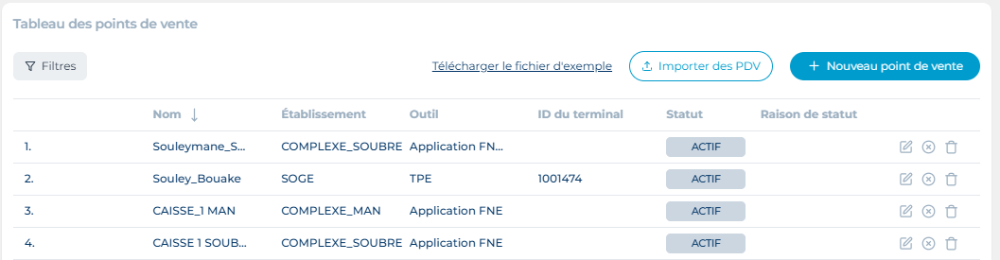 style="width:6.27917in;height:1.62153in" />▪ Remplissez le formulaire
> et cliquez sur **Créer**

Au cours de la création, vous devrez définir le nom de la caisse,
sélectionner l’établissement et le type d’outil de facturation utilisé à
cette caisse.

> p\. 15

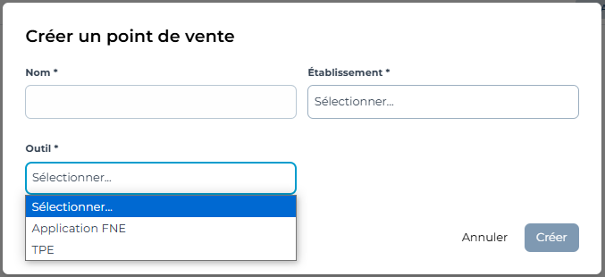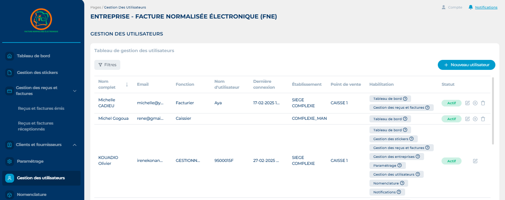

> ***Remarque*** *:* *les* *outils* *disponibles* *sont*
> *l’**application*** ***FNE*** *et* *le* ***TERNE**.* *Pour* *le*
> *choix* *d’un*
>
> ***TERNE**,* *l’ID* *du* *TERNE* *est* *requis* *et* *vous* *pouvez*
> *l’obtenir* *sur* *le* *TERNE.*
>
> **2.** **Gestion** **des** **utilisateurs**

Cette session permet la création des utilisateurs. Elle est gérée par le
gestionnaire principal, c’est lui qui définit l’habilitation de chaque
utilisateur.

> ***Remarque*** *:* *chaque* *utilisateur* *est* *rattaché* *à* *un*
> *établissement* *et* *à* *un* *point* *de* *vente.*
>
> p\. 16

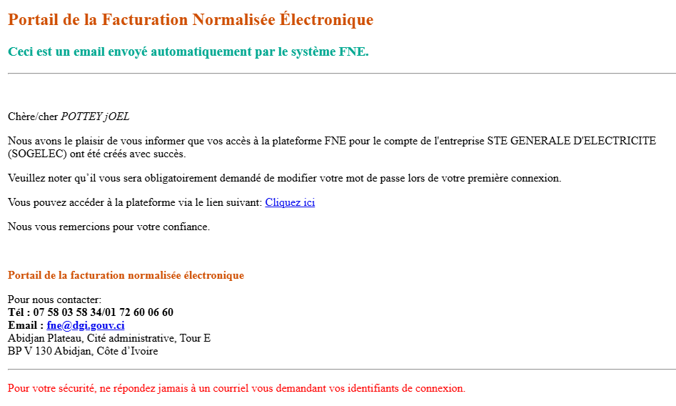

> ▪ Remplissez le formulaire, définissez les habilitations et cliquez
> sur « **Créer** **».**

Après la créationd’unnouvelutilisateur,celui-cirecevra unmailcontenantle
lienluipermettant

de créer ses accès sur l’application FNE.

> p\. 17

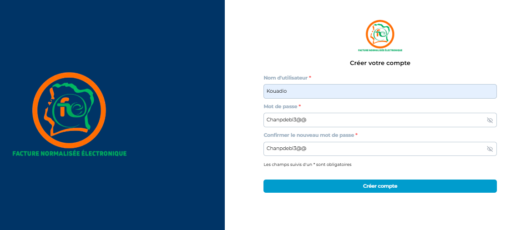

Après la réception du mail, six étapes sont nécessaires pour la création
des accès de

l’utilisateur.

**Etape** **5** : Cliquez sur le lien ***Cliquez*** ***ici*** ;

**Etape** **6** : Remplissez le formulaire en indiquant le nom
utilisateur et le mot de passe.

***NB*** *:* *Le* *mot* *de* *passe* *doit* *être* *composé* *d'au*
*moins* *12* *caractères* *et* *doit* *contenir* *au* *moins* *une*
*lettre* *majuscule,* *une* *lettre* *minuscule,* *un* *chiffre* *et*
*un* *caractère* *spécial.*

**Etape** **7** : Connectez-vous.

> p\. 18

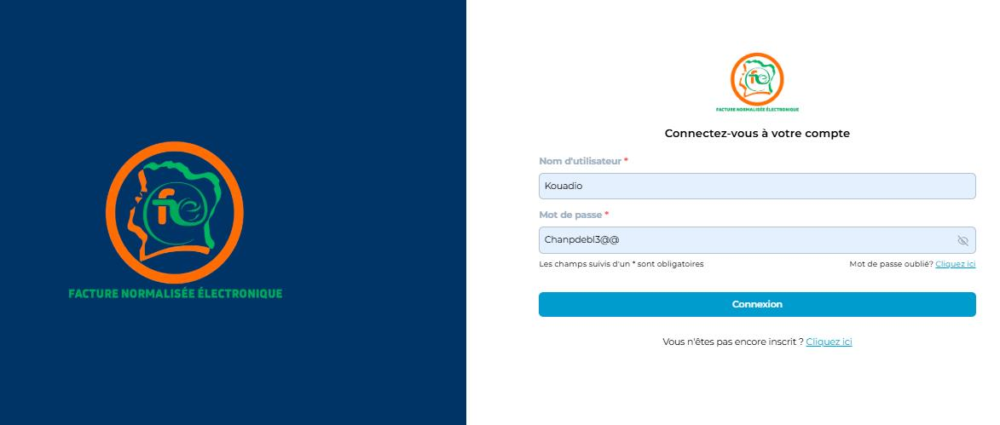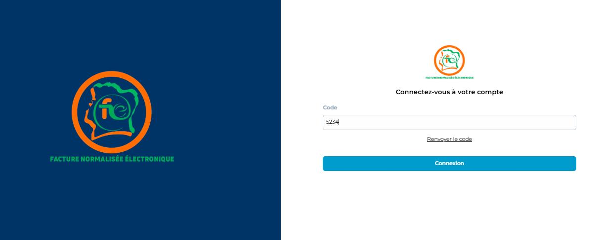

**Etape** **8** : Saisissez vos identifiants et connectez-vous.

**Etape** **9** : Entrez le code OTP.

**NB** : *Pour* *chaque* *connexion* *à* *la* *plateforme* *FNE,* *vous*
*recevrez* *un* *code* *OTP* *qui* *fait* *office* *d’une* *double*
*authentification.*

> p\. 19

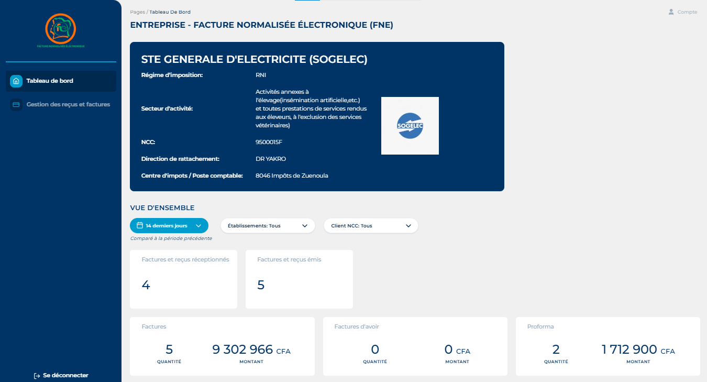

**Etape** **10** : Accédez à la plateforme FNE.

**IV-** **Présentation** **des** **menus** **de** **la** **plateforme**
**FNE** La plateforme FNE est composée des menus suivants :

\- Tableau de bord ;

\- Gestion des stickers ;

\- Gestion des reçus et factures : o Reçus et factures, émis ;

o Reçus et factures, réceptionnés. - Paramétrage ;

\- Gestion des utilisateurs ; - Nomenclature.

> p\. 20

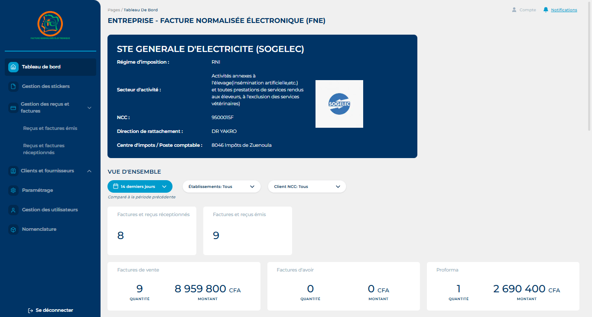

> **1.** **Tableau** **de** **bord**
>
> p\. 21

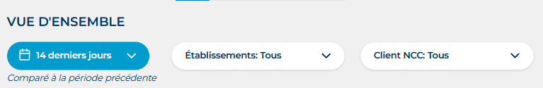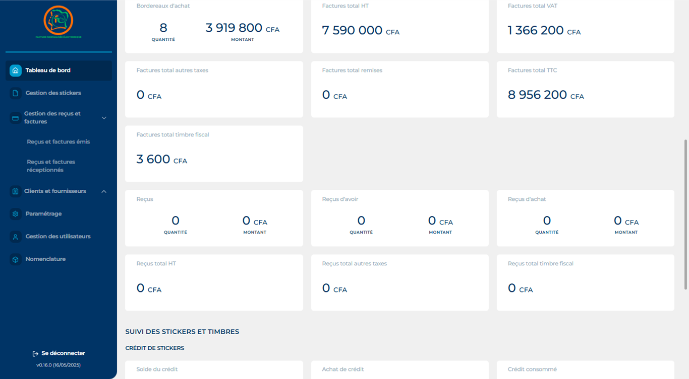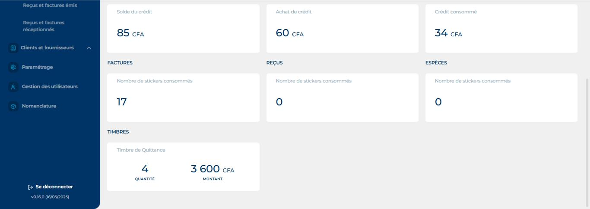

Le tableau de bord affiche les informations suivantes :

> \- Un ensemble de filtres présenté ci-dessous est utilisé pour affiner
> vos affichages :
>
> o **Période** **-** (par défaut, les données des 14 derniers jours
> s’affichent) sélectionner une période par défaut ou personnaliser-la ;
>
> o **Établissements** **:** **Tous** - Sélectionnez un ou tous vos
> établissements ; o **Client** **NCC** **:** **Tous** – Sélectionnez le
> ou les NCC de vos clients.

\- Factures et reçus réceptionnés : indique le nombre de factures et
reçus, reçus des fournisseurs **;**

> p\. 22
>
> \- **Factures** **et** **reçus** **émis** : indique le nombre de
> factures et reçus émis aux clients ;
>
> \- **Factures** **de** **vente** : indique le nombre et le montant
> total de toutes les factures émises ;
>
> \- **Factures** **d'avoir** : indique le nombre et le montant total
> des avoirs à partir des factures ;
>
> \- **Proforma** : indique le nombre et le montant total des pro-forma
> ;
>
> \- **Bordereaux** **d’achat** : indique le nombre et le montant total
> de tous les bordereaux d’achat émis ;
>
> \- **Factures** **total** **HT** : indique le montant de toutes les
> ventes HT ;
>
> \- **Factures** **total** **TVA** : indique le montant total des TVA
> de toutes les ventes ;
>
> \- **Factures** **totales** **autres** **taxes** : indique le montant
> total de toutes les autres taxes en dehors des taxes fixées dans la
> FNE ;
>
> \- **Factures** **total** **remises** : indique le montant total de
> toutes les remises ; - **Factures** **total** **TTC** : indique le
> montant TTC de toutes les ventes ;
>
> \- **Factures** **total** **timbre** **fiscal** : indique le montant
> total des timbres apposés sur les factures ;
>
> \- **Reçus** : indique le nombre et le montant total des reçus émis ;
>
> \- **Reçus** **d'avoir** : indique le nombre et le montant total de
> tous les avoirs à partir des reçus ;
>
> \- **Reçus** **total** : Indique le montant total des reçus émis sans
> les timbres de quittance ; - **Reçus** **total** **autres** **taxes**
> : indique le montant total de toutes les autres taxes en
>
> dehors des taxes fixées dans la RNE ;
>
> \- **Reçus** **total** **timbre** **fiscal** : indique le montant
> total des timbres de quittance apposés sur les reçus :
>
> o **Solde** **du** **crédit** **:** Indique le solde restant de
> stickers ;
>
> o **Achat** **de** **crédit** **:** indique le montant des achats de
> stickers ;
>
> o **Crédit** **consommé** **:** indique le montant de stickers
> consommés ;
>
> o **Nombre** **de** **stickers** **consommés** **:** indique le nombre
> de stickers (Factures, Reçus, Espèces) consommés ;
>
> o **Timbre** **de** **quittance** : indique le nombre et le montant
> total des timbres apposés sur les factures et reçus.
>
> p\. 23

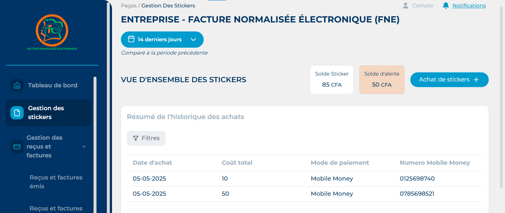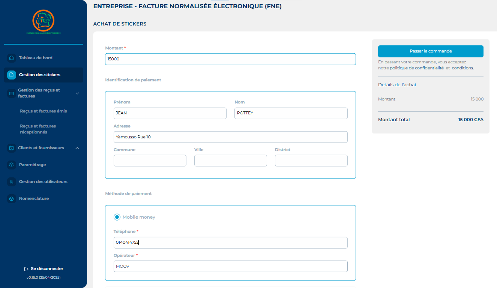

> **2.** **Gestion** **des** **stickers**

Cette section vous permet principalement d’effectuer des achats de
stickers. ▪ Processus d’achat

>  style="width:0.6894in;height:0.19653in" />o Effectuer un clic sur le
> bouton « **Achat** **de** **stickers** »
>
> o Achat de stickers
>
> p\. 24

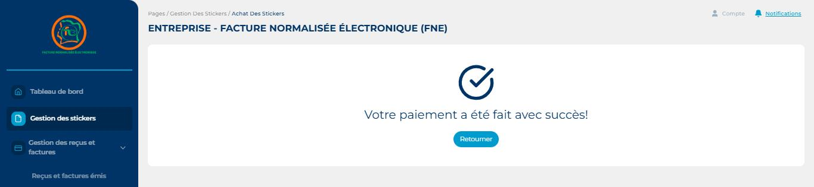

> Une fois le montant renseigné, appuyer sur « **Passer** **la**
> **commande** **»** pour valider la
>
> 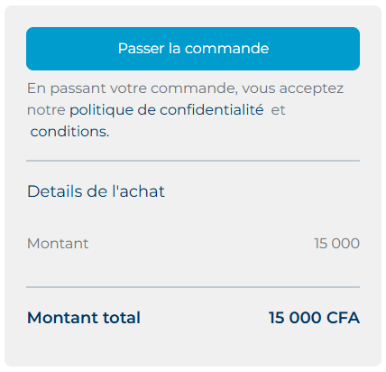 style="width:3.155in;height:0.29167in" />commande.

***Remarque*** *:* *après* *avoir* *sélectionné* *votre* *opérateur*
*réseau* *et* *saisi* *votre* *numéro* *de* *téléphone,* *suivez* *le*
*processus* *d’achat* *mobile* *money* *ou* *carte* *bancaire* *pour*
*terminer* *l’opération* *d’achat.* *Quel* *que* *soit* *le* *montant*
*d’achat* *du* *sticker,* *aucun* *frais* *supplémentaire* *n’est*
*appliqué.*

***NB*** *:* *L’achat* *par* *carte* *de* *crédit* *n’est* *pas*
*encore* *fonctionnel.*

> ▪ Une fenêtre d’information s’affiche quand l’opération d’achat a
> réussi.
>
> Après l’achat, vous avez une vue d’ensemble des stickers.
>
> ***NB*** *:* *Le* *solde* *sticker* *diminue* *à* *chaque*
> *génération* *de* *facture* *ou* *de* *reçus.*
>
> p\. 25

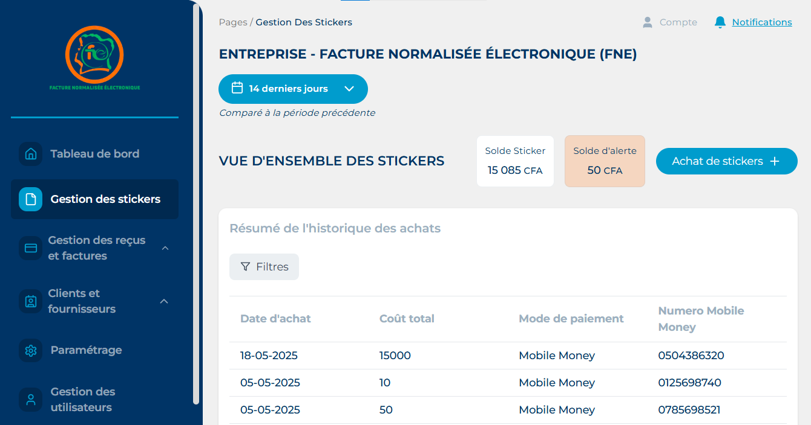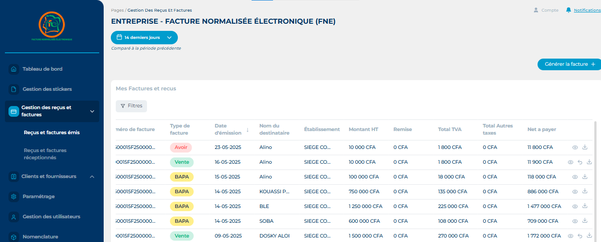

> **3.** **Gestion** **des** **reçus** **et** **factures** **3.1.**
> **Reçus** **et** **factures** **émis**

Cette session affiche l’historique des factures et reçus émis.

> p\. 26

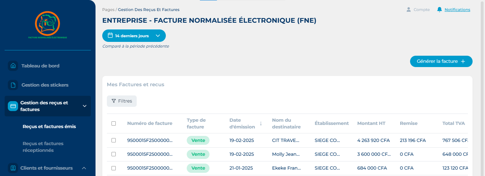

Après l’émission d’une facture, trois principales fonctions peuvent être
utilisées pour les

actions suivantes :

>  style="width:0.22062in;height:0.19653in" />- Pour avoir un aperçu de
> la facture, du reçu ou du bordereau émis ;
>
>  style="width:0.20278in;height:0.1965in" />- Pour effectuer un avoir
> sur une vente ;
>
>  style="width:0.21007in;height:0.19722in" />- Pour télécharger une
> facture, un reçu ou un bordereau.

***3.1.1.*** ***Processus*** ***d’édition*** ***d’une*** ***facture***
Pour éditer une facture, cliquer sur **Générer** **la** **facture.**

> p\. 27

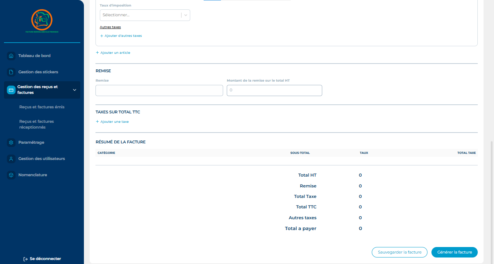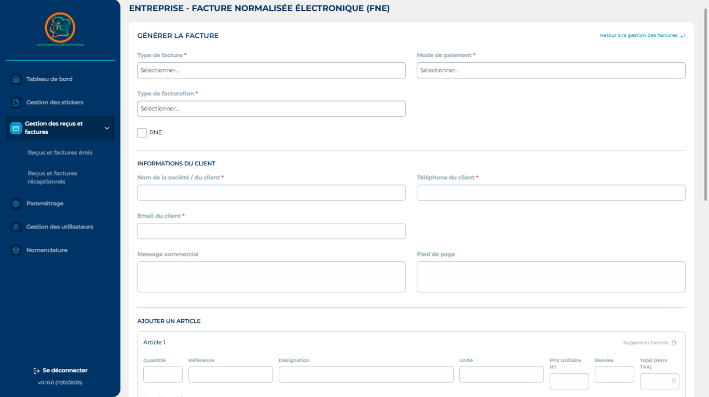

> ***3.1.2.*** ***Affichage*** ***et*** ***description*** ***du***
> ***formulaire*** ***de*** ***facturation***

Le formulaire de la facture est composé de six (06) parties : - Générer
la facture ;

> \- Information du client ; - Ajouter un article ;
>
> \- Remise ;
>
> \- Taxe sur total TTC ;
>
> \- Résumé de la facture.
>
> p\. 28

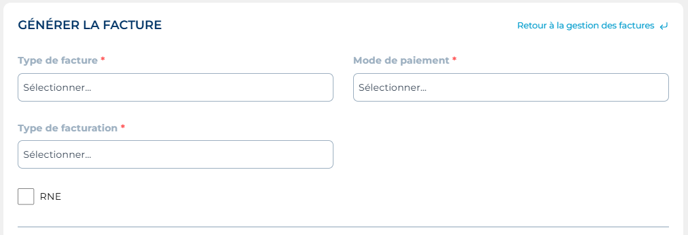

> ***3.1.3.*** ***Générer*** ***la*** ***facture***

Dans cette session, vous devrez définir le type de facture, le mode de
paiement et le type de facturation :

> \- **Type** **de** **facture** **:**
>
> o Vente (sélectionnez pour effectuer une vente) ;
>
> o Proforma (sélectionnez pour délivrer une proforma) ;
>
> o Bordereau d’achat (si cette option est activée dans le menu
> paramétrage). - **Mode** **de** **paiement** **:**
>
> o Carte bancaire ; o Chèque ;
>
> o Espèces ;
>
> o Mobile money ; o Virement ;
>
> o A terme.
>
> \- **Type** **de** **facturation** **:**
>
> o B2B (le client est une entreprise locale) **;**
>
> o B2C (le client est un consommateur final) **;** o B2F (le client est
> à l’international) **;**
>
> o B2G (le client est une institution gouvernementale)**.**
>
> p\. 29

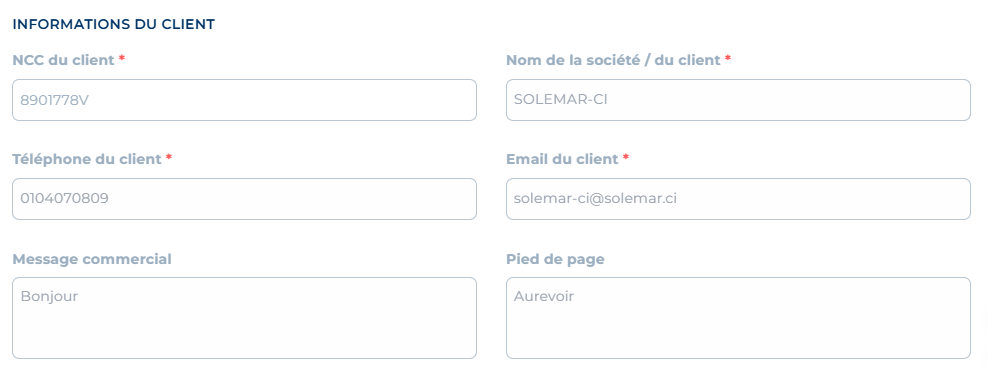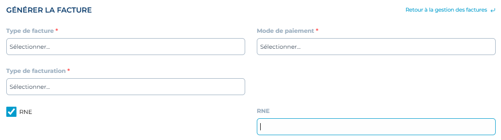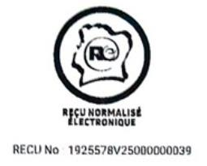

> ***Remarque*** *:* *pour* *éditer* *une* *facture* *à* *partir* *d’un*
> *reçu* *RNE,* *cochez* *la* *case* ***«*** ***RNE*** ***»*** *et*
> *saisissez*
>
> *le* *numéro* *du* *reçu.* *Renseignez* *tous* *les* *autres* *champs*
> *de* *la* *facture* *et* *générer* *la* *facture.*
>
> ***NB*** *:* *La* *génération* *de* *cette* *facture* ***ne***
> ***sera*** ***pas*** ***considérée*** ***comme*** ***une***
> ***double*** ***facture*** *dans*
>
> *votre* *comptabilité**.***
>
> **3.1.3.1.** **Informations** **du** **client**

Pour les facturations **B2B**, la saisie du NCC du client est le premier
élément à saisir. Le nom, le numéro de téléphone et le mail
s’afficheront automatiquement si le client est déjà inscrit sur la
plateforme.

Pour les facturations **B2C**, **B2F**, **B2G**, la saisie du nom du
client, le numéro de téléphone et le mail sont obligatoires.

Vous pouvez saisir votre message commercial et votre pied de page ou les
modifier.

> p\. 30

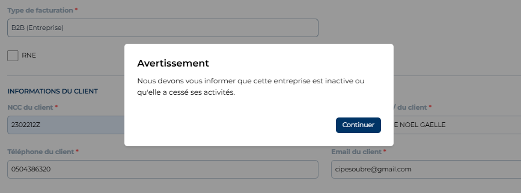

> ***Remarque*** *:* *au* *cours* *du* *remplissage* *du* *formulaire*
> *de* *facturation* *B2B,* *si* *le* *client* *est* *en*
>
> *cessation* *d’activité,* *vous* *serez* *informé* *par* *un*
> *message* *indiquant* *la* *cessation* *d’activité* *de* *ce*
> *client.* *Vous* *pouvez* *cliquer* *sur* ***«*** ***Continuer***
> ***»*** *ou* *interrompre* *la* *transaction.*
>
> **3.1.3.2.** **Ajouter** **un** **article**

Cette session vous permet de renseigner les informations sur les
articles à vendre. Elle est composée des informations suivantes :

> \- Quantité - la quantité à vendre pour cet article ;
>
> \- Référence - le code unique attribué à ce produit dans l’inventaire
> ; - Désignation - le nom du produit ;
>
> \- Unité - l’unité de mesure de l’article ;
>
> \- Prix unitaire HT - le prix de l’article sans la taxe ;
>
> \- Remise - la réduction sur le prix de l’article (exprimé en %) ; -
> Total (Hors TVA) : le montant total hors taxe de cet article ;
>
> \- Taux d’imposition : sélectionnez le type de taxe associée à cet
> article : o La TVA exo export - TVA sur HT ;
>
> o La TVA exonérée légale 0% ; o La TVA réduite 9% ;
>
> o La TVA normale 18% ;
>
> o La TVA exonérée conventionnelle 0%.
>
> p\. 31

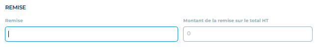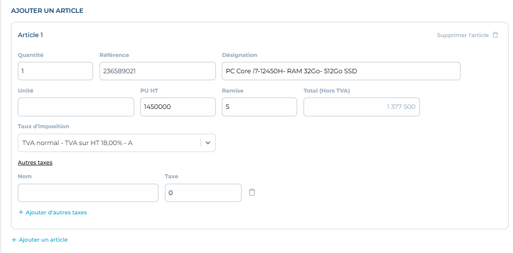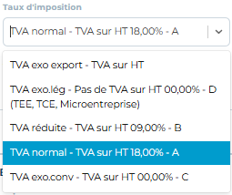

En-dehors des taxes précitées, s’il se trouve qu’une ou plusieurs taxes
sont appliquées à cet article, vous cliquez sur **«** **+** **Ajouter**
**d’Autres** **taxes** **»,** ensuite vous saisissez le nom de cette
taxe et le pourcentage de la taxe associée.

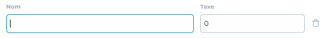**+** **Ajouter**
**d’Autres** **taxes**

Pour ajouter d’autres articles à votre facture, cliquez sur **«**
**+Ajouter** **un** **article** **».**

> **3.1.3.3.** **Remise**

Cette session est utilisée lorsque vous souhaitez faire une remise
globale sur le montant total hors taxe. Saisissez le pourcentage de la
remise et passez à l’étape suivante.

> p\. 32

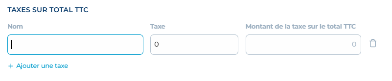

> **3.1.3.4.** **Taxes** **sur** **total** **TTC**

Cette session permet d’ajouter une taxe globale au total TTC de vos
articles. Saisissez le nom de cette taxe et son taux et passez à l’étape
suivante.

> p\. 33

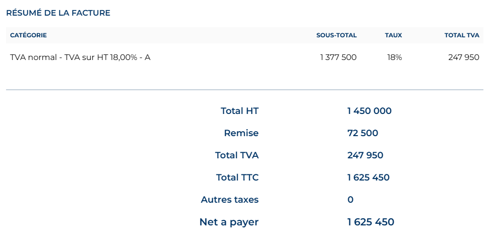

> **3.1.3.5.** **Résumé** **de** **la** **facture**

Cette session vous présente les détails de toutes les taxes, le cumul
des remises et le montant total à payer.

> **3.1.3.6.** **Boutons** **d’action**

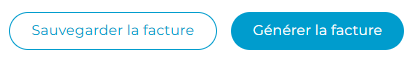Finalisez votre facture par
l’une des actions :

> \- **Sauvegarder** **la** **facture** : conserver la facture en vue
> d’une validation ultérieure ; - **Générer** **la** **facture** :
> valider la facture du client.
>
> ***Remarque*** *:* *une* *facture* *sauvegardée* *n’est* *pas*
> *signée,* *c’est-à-dire* *qu’elle* *ne* *comporte* *pas* *d’élément*
> *de* *sécurité* *(absence* *de* *QR* *Code* *et* *le* *numéro* *de*
> *série).*
>
> *Générer* *une* *facture* *consiste* *à* *produire* *une* *facture*
> *avec* *tous* *les* *éléments* *de* *sécurité* *(QR* *Code,* *numéro*
> *de* *série* *et* *logo* *FNE).*
>
> *Dès* *génération* *d’une* *facture* *ou* *d’un* *reçu,* *le* *client*
> *reçoit* *automatiquement* *la* *facture* *de* *son* *fournisseur*
> *dans* *son* *espace* *FNE.*
>
> p\. 34

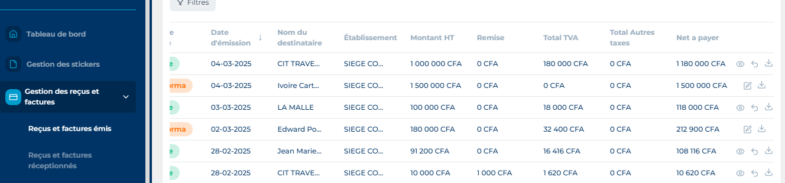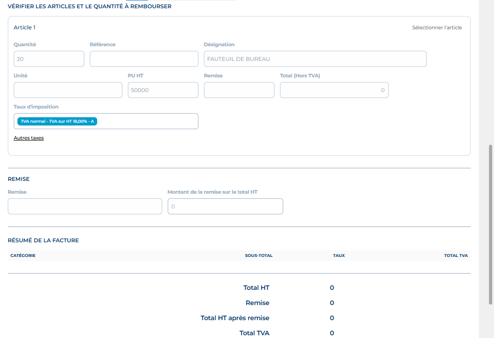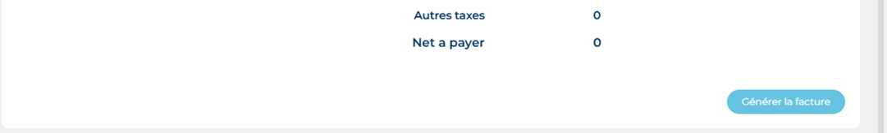

> ***3.1.4.*** ***Générer*** ***une*** ***facture*** ***d’avoir***

La génération d’une facture d’avoir se fait à partir d’une facture de
vente. Cette opération s’effectue en 03 étapes :

**Etape** **1** : Cliquez sur
le bouton retour

**Etape** **2** : Cliquez sur « **Sélectionner** **l’article** **».**

> p\. 35

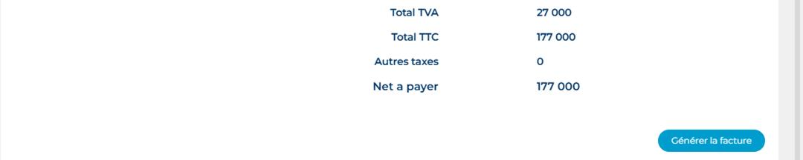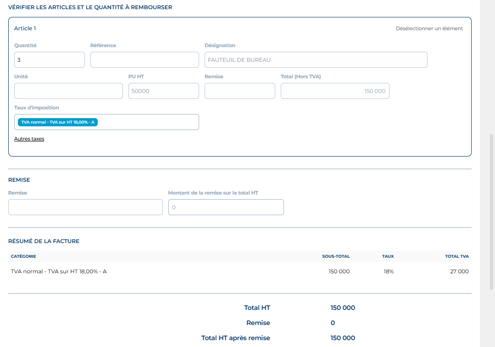

**Etape** **3** : Renseignez la quantité d’article à rembourser et
générez la facture.

***NB*** *:* *Dans* *l’édition* *d’une* *facture* *d’avoir,* *le* *seul*
*élément* *qui* *peut* *être* *modifié* *est* *la* *quantité.* *Dans*
*cet* *exemple,* *sur* *20* *articles* *achetés,* *03* *sont*
*retournés.*

> p\. 36

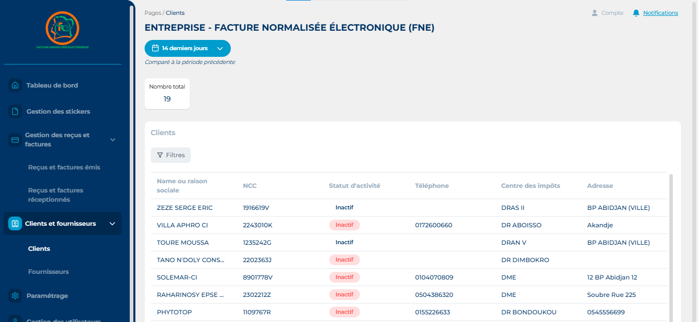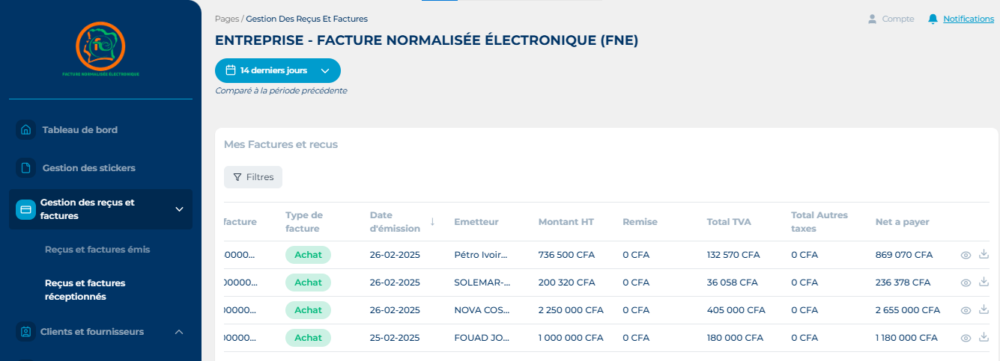

> **3.2.** **Reçus** **et** **factures,** **réceptionnés**

Dans cette session, vous trouvereztoutes les factures reçues et les
reçusde vos fournisseurs. Vous pouvez télécharger ou visualiser vos
factures en sélectionnant l’un des boutons appropriés à droite du
tableau.

> **4.** **Clients** **et** **fournisseurs**

Visualisez la liste de vos clients et fournisseurs à partir des boutons
**«** **Clients** **»** et **«** **Fournisseurs** **»**.

> \- **Aperçu** **de** **la** **fenêtre** **des** **clients**

Ce tableau vous donne la liste de tous vos clients sur une période.

A titre d’illustration, la capture ci-dessous affiche la liste des
clientsdes **«** **14** **derniers** **jours** **»**, en raison du
filtre de période appliqué.

> p\. 37

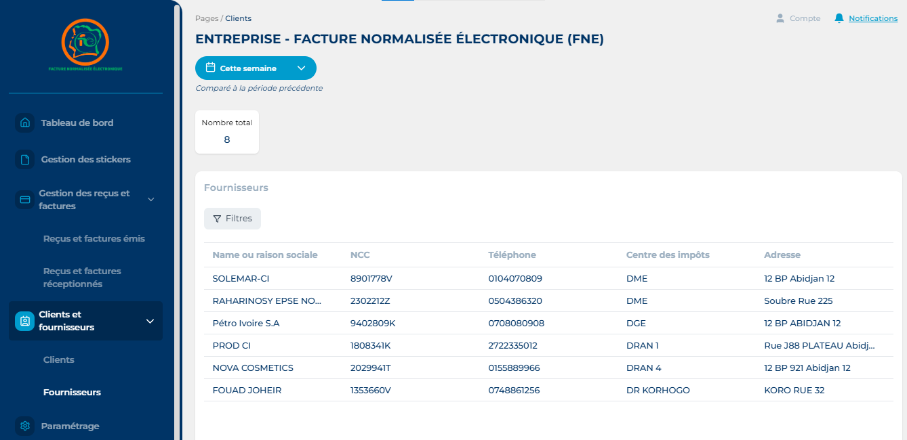

> \- **Aperçu** **de** **la** **fenêtre** **des** **fournisseurs**

Ce tableau vous donne la liste de tous vos fournisseurs sur la période.

A titre d’illustration, la capture ci-dessous affiche la liste des
fournisseurs de ‘cette semaine’, en raison du filtre de période
appliqué.

> **5.** **Paramétrage**

(Voir le point 1.1 de la configuration du portail FNE).

> **6.** **Gestion** **des** **utilisateurs**

(Voir le point 2 de la configuration du portail FNE).

> **7.** **Nomenclature**

Cettesessionvousdonne lapossibilité d’importerla listedetousvosproduits.
Cettelisteprend en compte les noms, références, désignations, PU HT,
taux d’imposition. A défaut, vous pouvez entrer les composants de vos
produits en détails.

Téléchargez le modèle du fichier à importer en cliquant sur «
**Télécharger** **le** **fichier** **d'exemple** **».**

> p\. 38

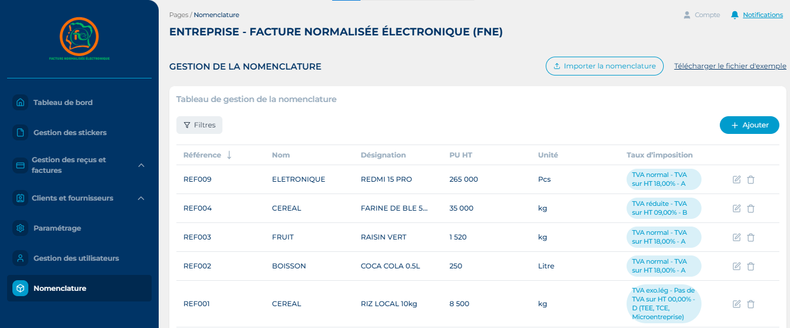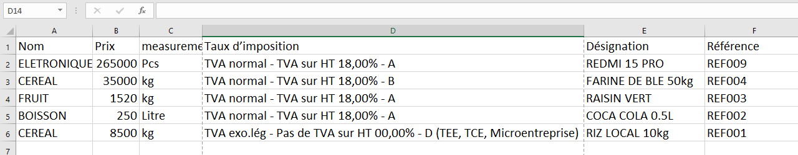

**Exemple** **de** **présentation** **de** **fichier** **d’importation**

> **V-** **Spécification** **du** **sticker**

Le stickerélectroniqueest
unélémentdesécuritéservantàgarantirlaconformitédelafacture. Il est
composé de trois (03) éléments distincts, obligatoires et simultanés :

> \- Le logo de la FNE ;
>
> \- Le numéro de facture selon un format spécial en série annuelle
> ininterrompue ; - Le QR Code de certification.
>
> **1-** **Le** **logo**

Le logo représente le visuel principal de la FNE.

> p\. 39
>
> **2-** **Le** **numéro** **de** **facture** **selon** **un**
> **format** **spécial** **en** **série** **annuelle**
>
> **ininterrompue**

C’est une séquence de numéro composée des éléments suivants : - Le NCC
du contribuable ;

> \- L’année de l’émission de la facture ; - Le numéro séquentiel de la
> facture.
>
> *Exemple* **9500015F** **25** **000000071**
>
> NCC Année Numéro séquentiel
>
> ***Remarque*** *:* *les* *numéros* *des* *factures* *d’avoir* *sont*
> *précédés* *de* *la* *lettre* ***A**,* *les* *pro-forma* *de* *la*
> *lettre* ***P**,* *les* *bordereaux* *de* *la* *lettre* ***B*** *et*
> *aucune* *lettre* *pour* *les* *factures* *de* *vente.*
>
> \- *Numéro* ***de*** ***facture*** ***de*** ***vente*** *:*
> 9500015F25000000071 ;
>
> \- *Numéro* *de* ***facture*** ***de*** ***proforma*** *:*
> ***P***9500015F25000000071 ; - *Numéro* *de* ***facture***
> ***d’avoir*** *:* ***A***9500015F25000000071 ;
>
> \- *Numéro* *de* ***bordereau*** ***d’achat*** ***de*** ***produit***
> ***agricole*** *:* ***B***9500015F25000000071.
>
> **3-** **Le** **QR** **Code** **de** **certification**

Le QR Code est aussi un autre
élément de sécurité. Il est apposé sur toutes les factures de vente, les
reçus et les bordereaux d’achat des produits agricole. Cependant, il
n’apparaitra pas sur les pro-forma. En le scannant, il affiche les mêmes
informations contenues sur la facture.

En scannant le QR Code, la facture s’affichera sur l’écran du téléphone.

> p\. 40

**VI-** **Composition** **d’une** **FNE** La FNE est composé :

> \- De l’entête de l’émetteur de la facture ; - Du logo de l’entreprise
> ;
>
> \- Des trois éléments de sécurisation (le sticker) : o Le QR Code de
> certification ;
>
> o Le logo FNE ;
>
> o Le numéro de facture selon un format spécial en série annuelle
> ininterrompue. - Des informations du récepteur de la facture ;
>
> \- Des détails de la vente ; - Du mode de paiement.
>
> p\. 41
>
> 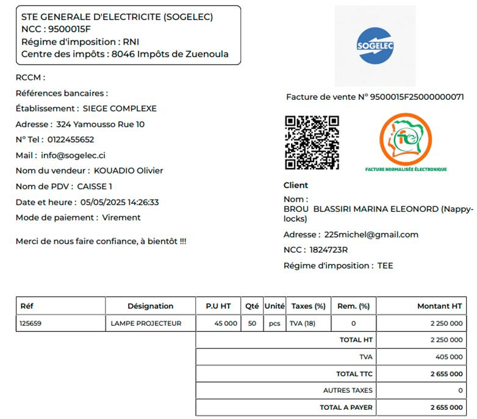 style="width:4.38153in;height:3.67278in" />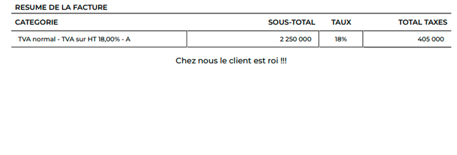 style="width:4.30292in;height:1.39083in" /> style="width:4.44833in;height:4.39333in" /> style="width:1.46833in;height:0.20333in" /> style="width:1.835in;height:0.58667in" /> style="width:1.785in;height:1.27333in" /> style="width:2.38833in;height:0.20333in" /> style="width:2.31167in;height:2.085in" /> style="width:1.835in;height:0.67167in" /> style="width:1.91667in;height:0.24333in" /> style="width:1.64167in;height:0.17833in" />L’entête de l’émetteur de
> la facture
>
> Logo de l’entreprise
>
> Les trois éléments de sécurisation :
>
> Le QR Code Le logo FNE Le numéro
>
> séquentiel
>
> Le récepteur de la facture
>
> Les détails de la vente

**VII-** **Composition** **d’une** **RNE** Le RNE est composé :

> \- Des trois éléments de sécurisation (le stickers) : o Le visuel FNE
> (1) ;
>
> o Le numéro de facture selon un format spécial en série annuelle
> ininterrompue (2) ; o Le QR Code de certification (3).
>
> \- Des informations du vendeur (4) ; - Des informations du client (5)
> ;
>
> \- Le montant de la vente (6) ; - Mode de paiement (7).
>
> p\. 42
>
>  style="width:3.155in;height:6.58167in" />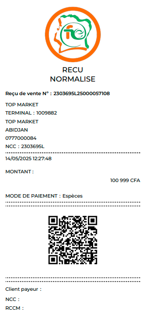 style="width:3.15639in;height:6.78194in" /> style="width:2.37667in;height:0.86667in" /> style="width:0.89667in;height:0.40667in" /> style="width:0.28667in;height:0.18833in" /> style="width:0.28667in;height:0.18833in" /> style="width:0.28667in;height:0.18667in" /> style="width:0.28667in;height:0.18833in" /> style="width:0.28667in;height:0.18833in" /> style="width:0.28667in;height:0.18667in" /> style="width:0.28667in;height:0.18833in" />1
>
> 2
>
> 4
>
> 5
>
> p\. 43
>
> **VIII-** **Contacts** **utiles**

||
||
||
||
||
||
||

> p\. 44
